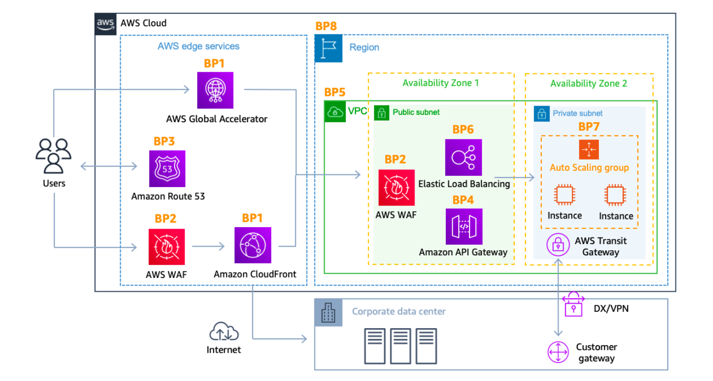
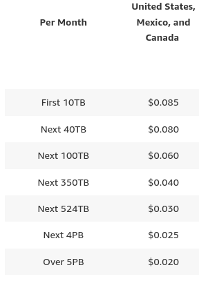
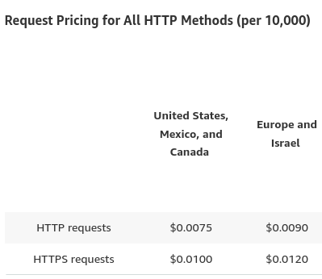
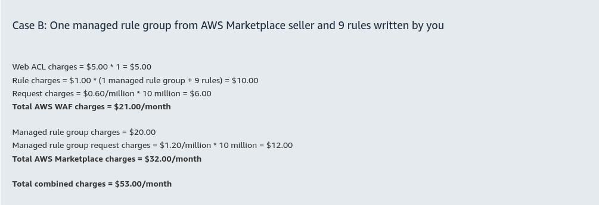
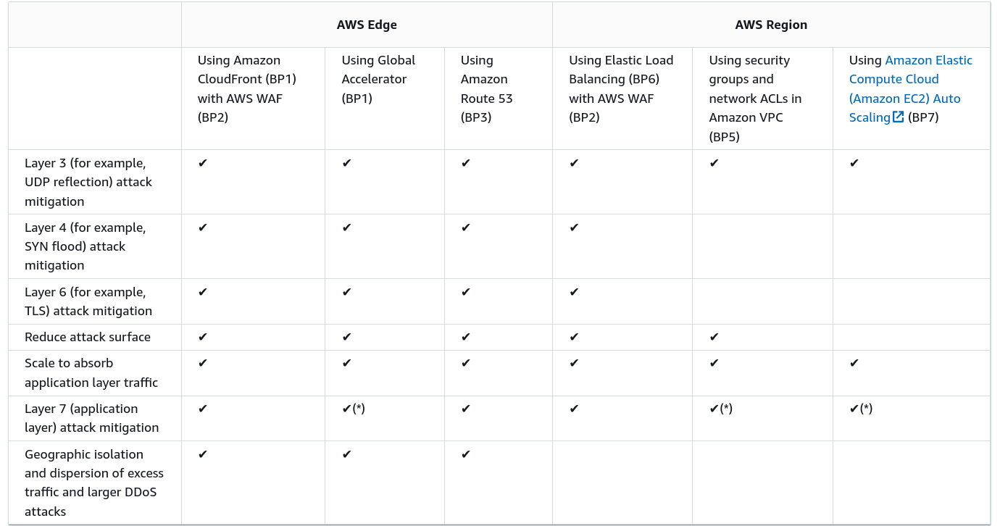

# DDoS Mitigation

- ## Cloud Front:

  - Using Content Delivery Network CDN CloudFront to cache and serve static text and images or downloadable objects is common strategy to improve webpage load times and mitigate DDoS.
  - **Pricing**:

    - Any cacheable data transferred to CloudFront edge locations from AWS resources incurs no additional charge. CloudFront charges for data transfers out from its edge locations, along with HTTP or HTTPs requests.

    - Free Tier includes 1 TB of data transfer out to the internet per Month and 10,000,000 HTTP or HTTPs requests per month and 2,000,000 CloudFront function invocations per month, Free SSL certificates.

    
    

- ## AWS WAF:

  - Web Application Firewall that can be deployed on CloudFront to help protext against DDos by giving control over which traffic to allow or to block by defining security rules.

  - Define web ACLs and apply them to cloudFront distributions, and web ACLs are evaluated in the priority order you specified when you configured.

  - We can blacklist addresses that exceed request limitS which can be useful for mitigation HTTP flood attacks.

  - There are prebuilt CloudFormation template input into the creation of `CommonAttackProtection` stack that includes AWS WAF web ACLs used to block, allow or count requests that meet the criteria defined in each rule.
  - **WAF Common rules**:
    - Use rate-based rules.
    - Review existing rate-based rules and consider lowering the rate limit threshold to block bad requests.
    - Query the AWS WAF logs to gather specific information of unauthorized activity.
    - Create a geographic match rule to block bad requests originating from a country that isn't expected for your business.
    - Create an IP set match rule to block bad requests based on IP addresses.
    - Create a regex match rule to block bad requests.
  - **Pricing**:

    - Any cacheable data transferred to CloudFront edge locations from AWS resources incurs no additional charge. CloudFront charges for data transfers out from its edge locations, along with HTTP or HTTPs requests.
    - Free Tier includes 1 TB of data transfer out to the internet per Month and 10,000,000 HTTP or HTTPs requests per month and 2,000,000 CloudFront function invocations per month, Free SSL certificates.
    - AWS WAF charges are based on the number of web access control lists (web ACLs) that you create, the number of rules that you add per web ACL and the number of web requests that you receive.
    - Each Web ACL costs 5$ per month and each rule costs 1$ monthlly for each 1 million requests we are charged on 0.60$
    - For each Rule groupe you will be charged for  
      You will be charged an additional $0.20 per million requests for each 500 WCUs the WEB ACL uses beyong the default allocation of 1500.

    - You will be charged per CAPTCHA attempt and challenge response ( captcha 4$ per ten thousand attempts analyzed) and challenge 0.4$ per million responses served

    

Deploying CloudFront, Route53 and AWS WAF enables the built-in DDoS protections for your dynamic web applications that are included with AWS Shield Standard which is designed to meet the needs of many dynamic web applications ( no charge for AWS shield Standard).

AWS Shield Advanced provides additional DDoS mitigation capacity attack visibility, cost protection and access to the AWS DDoS response team DRT.

