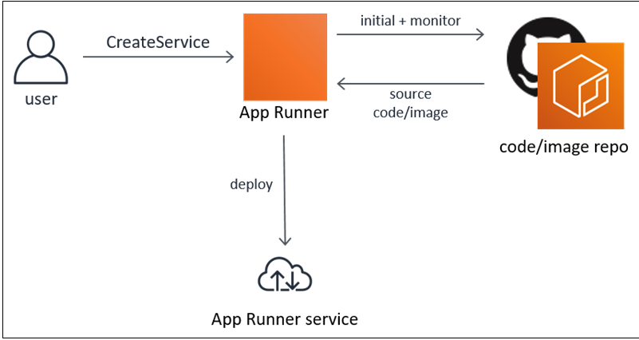
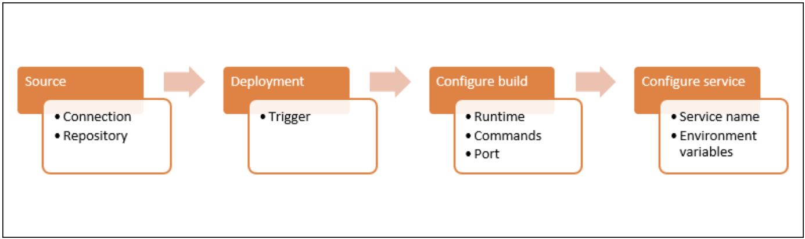

# App Runner:

- App runner connects directly to the source code or ECR. it provides an automatic integration and delivery pipeline with fully managed operations, high performance, scalability and security.
  
- App runner enables automatic deployments each time a commit is pushed to the code repository or a new container image version is pushed to the image repository.
- With app runner your only pay for resources that your service consumes.

## Getting started App Runner:

- App Runner costs: `$0.064 per hour per vCPU` and `$0.007 per hour per GB memory`.

### Useful Links

[App Runner Terraform Module](https://github.com/terraform-aws-modules/terraform-aws-app-runner)
