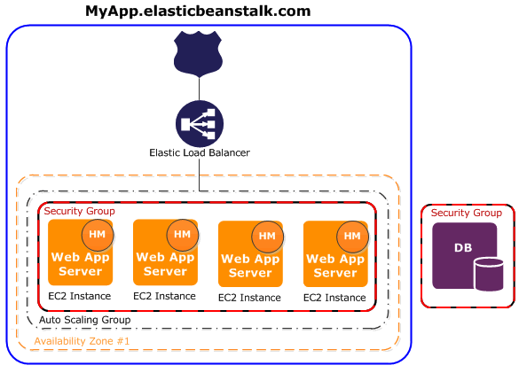

# AWS Elastic Beanstalk

- Elastic beanstalk is a service for deploying and scaling web applications and services.
- Elastic beanstalk automatically handles the deployment - from capacity provisionning, load balancing, and auto scaling to application health monitoring.
- Elastic beanstalk uses core AWS services such as EC2, ECS, AWS Auto Scaling, ELB.

## Web server environments

- When an environement is created, all the resources required to run your application are provisioned with it. These resources include EC2, ELB, Autoscaling group etc.
- Every environement has a CNAME URL that points to a load balancer. This url is aliased in route53 to ELB url.
- Each EC2 instances of beanstalk has a software component called `Host manager HM` and he is responsible for:
  - Depoying the app
  - Aggregating events and metrics for retrieval
  - Generating instance level events
  - Monitoring the app log file for critical errors
  - Monitoring the app server
  - patching instance components
  - rotating the app log file and pushing them to s3
- By default, Elastic beanstalk defines a security group that allows everyone to connect using port HTTP 80.

- Web environment tier has basically an ELB that is distributing traffic to EC2 instances that are running under an autoscaling group spanning over two AZs or more.
- Worker environment tier is different as it has an SQS queue that is sending SQS messages to EC2 instances running under an autoscaling group spanning over two AZs or more. This environement will scale based on the number of messages in the queue.

## Overview:

- Beanstalk is free but you pay for the udernlying resources.
- **Application**: Collection of Elastic Beanstalk components (environements, versions, configurations..)
- **Application version**: an iteration of your application code
- **Environement**:
  - Collection of AWS resources running an application version (only one application version at a time)
  - Tiers: Web server environement & worker environement
  - You can create multiple environements (dev, test, prod..)
- For the application load balancer, we can use either a dedicated one or we can use a shared load balancer among multiple elastic beanstalk environements
- You can create a new environment by clonning an existing environment and then swap which will make prod->dev and dev-> prod for example.
- Elastic beanstalk can store at most 1000 application versions
- If you don't remove old versions, you won't be able to deploy anymore.
- You can use a beanstalk lifecycle policy to phase out old application versions
- Beanstalk relies on cloudformation to provision other AWS services using infra as code. This means that using .ebextensions you can provision whatever AWS resources that you need.
- After creating beanstalk environment you cannot change the ELB type (for example change from CLB to ALB).

## Beanstalk Deployment options:

- **All at once**: fastest, but instances aren't available to serve traffic for a bit (downtime)
- **Rolling**: update a few instances at a time (bucket), and then move onto the next bucket once the first bucket is healthy.
- **Rolling with additional batches**: like rolling but spins up new instances to move the batch (so that old application is still available)
- **Immutable**: spins up new instances in a new ASG, deploys version to these instances and then swaps all the instances when everything is healthy.
- **Blue Green** create a new environment and switch over when ready.
  **Traffic splitting**: canary deployment - this when you want to test something new.
- Elastic Beanstalk with Docker environment requires you to have `docker-compose.yml`

## How to?

#### 1. Use image from private registry:

- Elastic beanstalk automatically authenticates to the ECR using the environment instance profile.
- You need to add `AmazonEC2ContainerRegistryReadOnly` managed policy.
- You can also configure the beanstalk to login to private registry using secrets that it gets from AWS SSM.

## Useful Resources:

- [Deploy Docker application on beanstalk](https://docs.aws.amazon.com/elasticbeanstalk/latest/dg/docker-quickstart.html)
- [CICD with Elastic Beanstalk, CodePipeline, &ECR](https://aws.plainenglish.io/ci-cd-with-elastic-beanstalk-codepipeline-ecr-515b23a5e2c9)
- [Deploy Dockerized Application To AWS Elastic Beanstalk
  ](https://bentranz.medium.com/deploy-dockerized-application-to-aws-elastic-beanstalk-f8a3cf2944a7)
- [Using images from private registry](https://docs.aws.amazon.com/elasticbeanstalk/latest/dg/docker-configuration.remote-repo.html)
