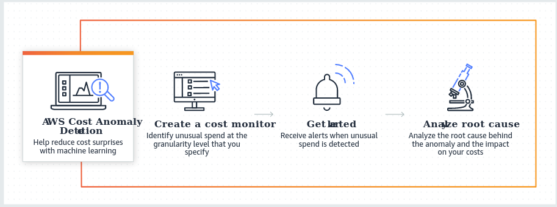
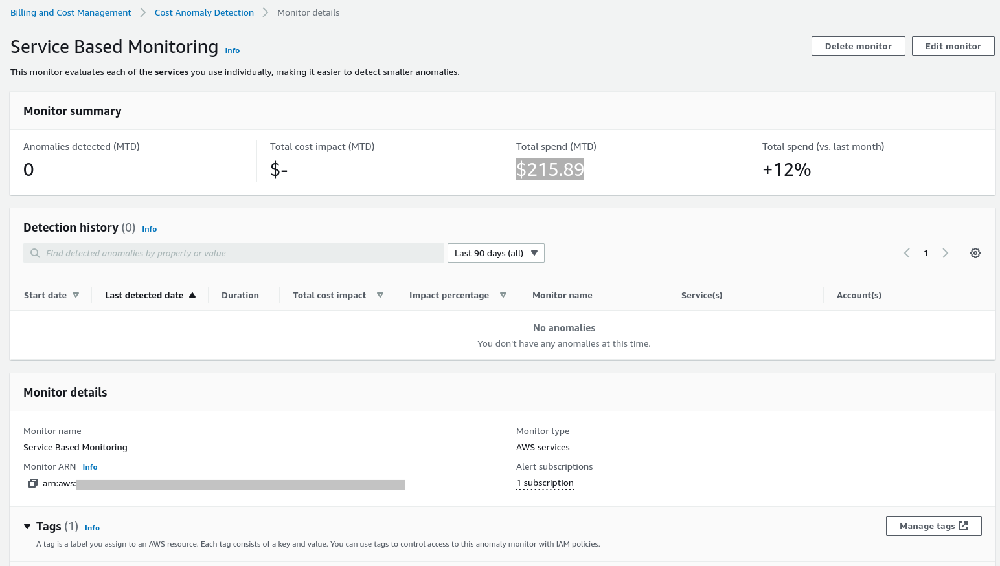
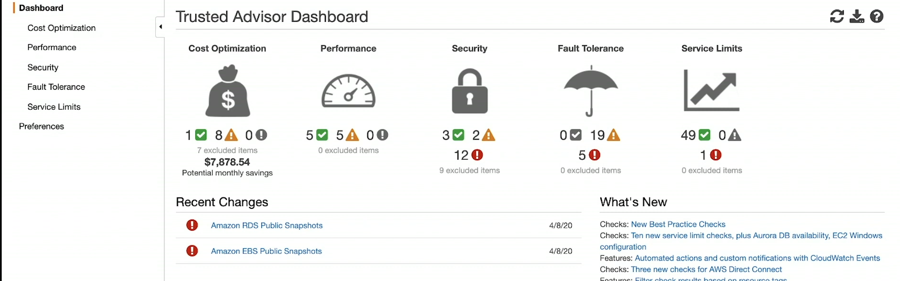

# AWS Cost Optimization Hub:
- Easily identify, filter and aggregate over 15 types of AWS cost optimization recommendations, such as EC2 instance rightsizing recommendations, Graviton migration recommendations,idle resource recommendations, and Savings Plans recommendations, across your AWS accounts and AWS Regions through a single dashboard.
- Cost Optimization Hub is a `free service`
# AWS Cost Anomaly Detection:
- Evaluate Spend Anomalies for all AWS services individually, member accounts, cost allocation tags or cost categories.
- Cost Anomaly Detection leverages advanced Machine Learning technologies to identify anomalous spend and root causes, so you can quickly take action.
- Cost Anomaly Detection is a `free service`. However, you can incur charges if you enable Amazon SNS alert notifications

### Overview:
- Cost Anomaly Detection summary provides an outline of any cost anomalies we detect, and summarizes the impact on your overall spend.
- The Detection history section provides a list of all anomalies detected over your chosen time frame. By default, we show you information for the last 90 days.
- AWS will automatically alert you to changes in your overall spend patterns, but you can also create custom monitors by going to the Cost monitors tab.
- The easiest way to get started is to enable the AWS services monitor. This monitor tracks each service individually and alerts you to any unexpected cost spikes.

# AWS Trusted Advisor:
- Optimize costs, improve performance, Address security gaps.
- Trusted advisor continiously evaluates your AWS environment using best practices checks across the categories of cost optimization, performance, resilience, security, operational excellence and service limits

# Cost Optimization Strategies:
- **Savings Plans**: UP to 72% savings on your AWS usage for services like EC2, Lambda, Fargate in exchange for commitment to specific usage measured in `$/hour` for `one to three-year period`
- **Identify under-utilized Amazon EC2 instances**: Use `AWS instance Scheduler` to automatically stop insta    nces and `AWS Operations Conductor` to automatically resize instances based on recommendations from `AWS Cost Explorer Resource Optimization`
- **Identify Under-utilized Amazon RDS and Amazon RedShift instances**: use `AWS Trusted Advisor` to identify under-utilization.
- **Use Auto Scaling or DynamoDB on-Demand**: Enable Auto Scaling on existing tables or use the on-demand option so you only pay for what you use.
- **Identify under-utilized Amazon EBS Volumes**: EBS volumes that have very low activity (less than one IOPS per day) over a period of 7 days indicate low utilization. Identify under-utilized volumes using `AWS Trusted Advisor`, `Amazon Data Lifecycle Manager` to automate the creation of volume snapshots then delete under-utilized volumes.
- **Analyze Amazon S3 usage**: Use `Amazon S3 Analytics Storage Class Analysis` to analyze storage access patterns on the object data set and `S3 Intelligent-Tiering` to automatically analyze and move your object to the appropriate storage tier. 
- **Review networking**: Use `AWS Trusted Advisor` to receive a report of load balancers that have `RequestCount` of less than 100 over the past 7 days. Learn how to delete ELB and use `Cost Explorer to analyze your data transfer costs`.
- **Modernize for better price / performance**: Use `AWS Cost Explorer` to review your consumption profile, and look for opportunities to make use of the latest instance families which offer better price - performance. Also ensure that any new deployments are using the most modern AWS offerings.