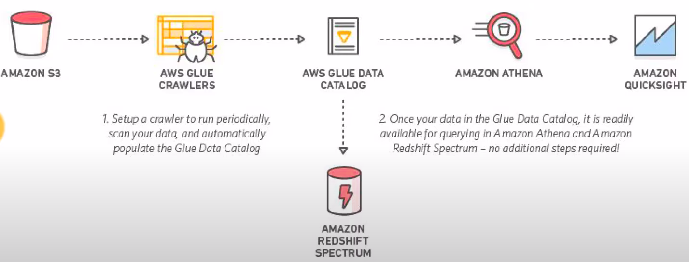
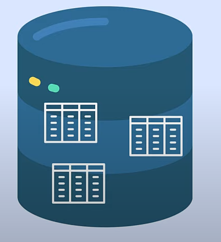

# Athena

- **Athena Pricing**
    - 5$ per TB data scanned
    - charged for the number of bytes scanned with a minimum 10MB per query
    - No change for DDL
    - Charges for cancelled queries (for the data scanned)
- **Save Cost**:
    - Columnar formats (Parquet and ORC)
    - Using partitions
    - Compression (gzip, snappy)
    - Number of files (more related performance optimization): Size of files should be large enough (between 10MB to 50MB) so that athena should not spend effort in scanning multiple small files
- **Views**: Allow you to combine results from multiple tables.
- Query results and metadata information is stored in S3, We need to specify the output folder in s3 for storing output. 

# AWS Glue:
- AWS Glue is a fully managed ETL service
- Consists of a central metadata repository called `Glue Data Catalog`
- Has a Spark ETL Engine

- **AWS Data Catalogue**: Persistent Metadata Store. It is a managed service that lets you store, annotate and share metadata which can be used to query and transform data.
- Examples of Metadata: Data location, Schema, Data Types, Data Classification.
- One AWS Glue Data Catalog per AWS Region.
- **AWS Glue Database**: A set of associated Data Catalog table definitions organized into a logical group. It does not move the data anywhere, it only logically groups them

- **AWS Glue Table**: The metadata definition that represent your data. The data resides in its original store. This is just a representation of the schema.
- **Partitions In AWS**: Folders where data is stored on S3, which are physical entities, are mapped to partitions, whiche are logical entities i.e. Columns in The Glue Table.

- **AWS Glue Crawler**: A program that connects to a data store, progress through a prioritized list of classifiers to determine the schema for your data, and then creates metadata tables in the AWS Glue Data Catalog.
- **AWS Glue Connections**: A data Catalog object that contains the properties that are required to connect to a particular data store. In other words the connection is the username and password to connect to the datastore.
- **AWS Glue Job**:The business logic that is required to perform the ETL work. It is composed of a transformation script, data sources, and data targets. Job runs are initiated by triggers that can be scheduled or triggered by events.
- **AWS Glue Triggers**: Initiates an ETL job. Triggers can be defined based on scheduled time or an event.
- **AWS Glue DEV Endpoints**: A development endpoint is an environment that you can use to develop and test your aws Glue scripts. Its esentially an abstracted cluster. NB The cost can add up.
# AWS Glue Crawler:
- A crawler accesses your data store, extracts metadata, and creates table definitions in the AWS Glue Data Catalog. The Crawlers pane in the AWS Glue console lists all the crawlers that you create. The list displays status and metrics from the last run of your crawler.
