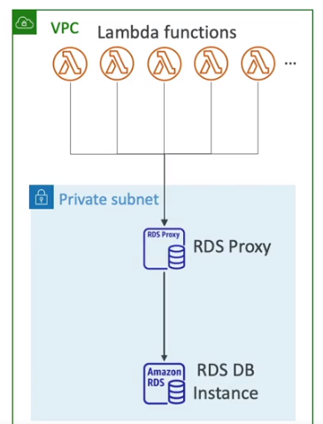

# Amazon RDS:
- RDS stands for Relational Database Service.
- It is a managed DB service for DB using SQL as a query language.
- Databases proposed:
    - Postgres
    - MySQL
    - MariaDB
    - Oracle
    - Microsoft SQL Server
    - Aurora
- RDS storage is backed by EBS (gp2 or io)
- Helps you increase storage on your RDS DB instance dynamically.
- When RDS detects you are running out of free database storage, it scales automatically.
- Avoid manually scaling DB storage.
- You have to set Maximum Storage Treshold (maximum limit for DB storage)
- Automatically modify storage if:
    - Free Storage is less than 10% of allocated storage
    - Low storage lasts at least 5 minutes
    - 6 hours have passed since last modification
## RDS Read Replicas for read scalability:
- We can set RDS read replica within AZ, Cross AZ or Cross Region
- Replication is ASYNC sor reads are eventually consistent.
- In aws there's a network cost when data goes from one AZ to another. But for most managed services like RDS, you don't pay that fee for read replicas within the same region.
- You can set read replicas as multi az for read replicas.
- **From Single-AZ to Multi-AZ**: Zero downtime operation, just click on modify and click multi-az.
- gp2 storage is lower performance that io1

# Amazon Aurora:
- Postgres and MySQL are both supported as AuroraDB (drivers will work as if Aurora was a Postgres or MySQL db).
- Aurora is AWS cloud optimized and claims 5x performance improvement over MySQL on RDS, over 3X the performance of postgres on RDS.
- Aurora storage grows automatically in increments of 10 GB.
- Aurora can have up to 15 replicas.
- Aurora costs more than RDS (20% more) - but is more efficient.
- Stores 6 copies of your data across 3 AZ:
    - 4 copies out of 6 needed for writes
    - 3 copies out of 6 needed for reads
    - self healing with peer to peer replication
    - storage is striped across 100s of volumes
- Automated failover for master in less than 30 seconds.
- support for cross region replication.
- Backtrack: restore data at any point of time without using backups.
## RDS & Aurora Security:
- **At-rest-encryption**:
    - DB master & replicas encryption using KMS - must be defined at launch time.
    - If the master is not encrypted, the read replicas cannot be encrypted.
    - To encrypt an un-encrypted db, go through a DB snapshot & restore as encrypted.
- **In-flight encryption**: TLS read by default.
- **IAM Authentication**
- **NO SSH**: except for aws custom service
- **Security Groups**
- Oracle Does not support IAM Database authentication
## RDS Proxy:
- Allows apps to pool and share DB connections established with the db
- Improving the db efficiency by reducing the stress on d resource like CPU, RAM and minimize open connections(and timeouts).
- RDS is serverless.
- Reduced RDS & Aurora failover time by up 66%
- Enforce IAM auth for db, and securely store credentials in AWS Secrets Manager.
- RDS Proxy is only accessible from within the VPC.

# Amazon ElastiCache Overview:
- ElastiCache is to get managed Redis or Memcached.
- Caches are in memory db with really high performance, low latency.
- Helps redyce load off of db for read intensive workloads.
- `Using elastiCache involves heavy application code changes` 
- **Redis**:
    - Multi-AZ with Autofailover
    - Read replicas to scale reads and have high availability
    - Data durability using AOF persistence
    - Backup and restore features
    - support sets and sorted sets
- **Memcached**!
    - No high availability (replication)
    - non persistent
    - no backup & restore
    - Multi threaded architecture
# Amazon MemoryDB for Redis:
- redis-compatible, durable, in memory db service
- ultra-fast performance with over 160 millions requests/second
