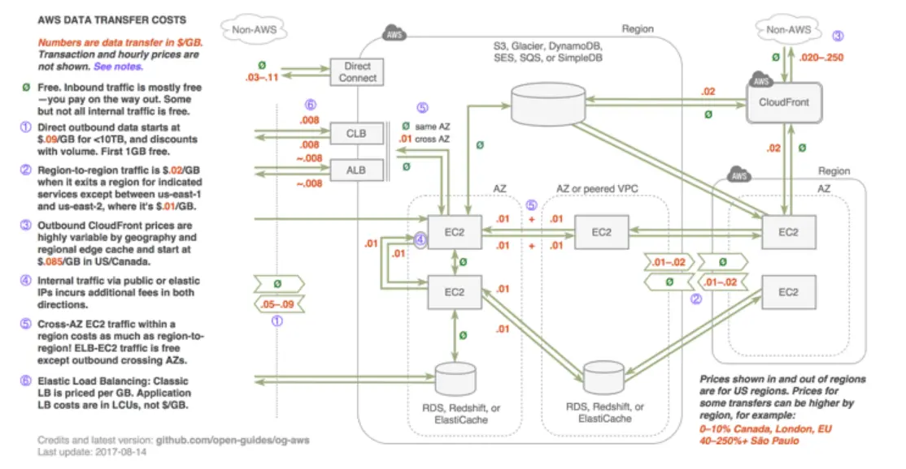

# Nat Gateway:
- You an use a NAT gateway so that instances in a private subnet can connect to services outside your VPC  but external services cannot initiate a connection with those instances.
- `public`: instances in private subnet can connect to internet through a public NAT gateway, but cannot receive unsolicited inbound connections from internet. you route traffic from the NAT gateway to the internet gateway for the vpc. Alternatively, you can use a public NAT gateway to connect to other VPCs or your on-premises network. In this case you route traffic from the NAT gateway through transit gateway or virtual private gateway.

# Analysis:
- NAT Gateway is used to either
    - Connect instances in private subnet to internet or external services without making them accessible (Connect from NAT gateway to internet gateway)
    - Connect instances in private subnet to other VPCs or your on-premise network through `Transit gateway` or `Virtual private gateway`
# Pricing:
- Charget for every hour that NAT Gateway is available and each gigabyte of data that it processes.
- NAT gateway that has a per hour per gigabyte charge
- You are charged for traffic between AZs and much more for traffic between regions
- The exception to this is traffic between us-east-1 and us-east-2. This is billed at half price, of the same as inter-az. 
- In addition, some organizations forget that a NAT gateway is unnecessary to transfer data. Instead, you could set up and use a Type `VPC endpoint gateway` to avoid hourly and data processing fees when sending data to or from Amazon S3.
# How to reduce cost?
- If your AWS resources send or receive a significant volume of traffiw across AZs, ensure that resources are in the same AZ as the NAT Gateway. Alternatively, create a NAT gateway in each AZ with resources.
- If most traffic through your NAT gateway is to AWS services that support interface endpoints or gateway endpoints, consider creating an interface endpoint or gateway endpoint for these services. 

# Resources:
- [Reduce Nat Gateway pricing](https://www.cloudzero.com/blog/reduce-nat-gateway-costs/)