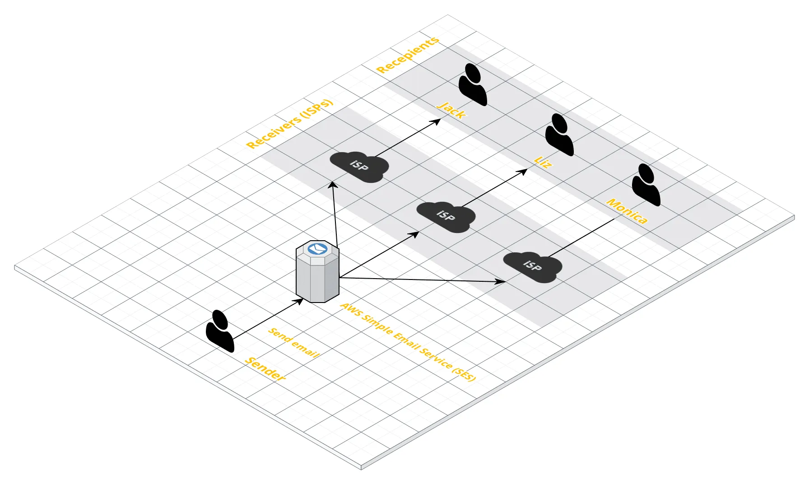
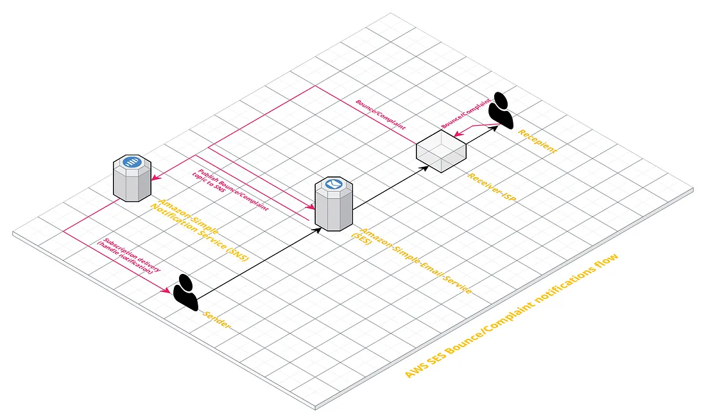

# Amazon SES
- When using SES to send emails, first we start with a sandbox mode and before AWS approves our service quota increase and take the ses out of sandbox mode we have to add a flow that handles email bounces and complaints.
- These rules are enforced by aws as they try to maintain a reputation of only delivering mail people want and thereby maintaining a high deliverability for legitimate mail.
- Two main concepts related to mailing:
    - **Bounces**: email cannot be delivered for some reason
    - **Complaint**: are reports made by recipients against emails they don't want in their inbox.
- Overview of Sending process:

- Overview of Handling Bounces/complaints:

- In order to read more about the subject of mitigating bounces/complaints refer to [How to handle AWS SES bounces and complaints](https://medium.com/@serbanmihai/how-to-handle-aws-ses-bounces-and-complaints-53d6e7455443)