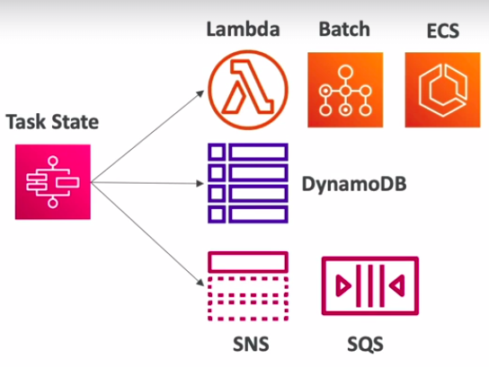
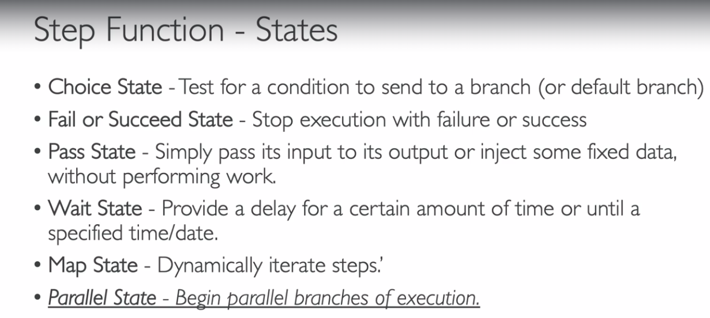
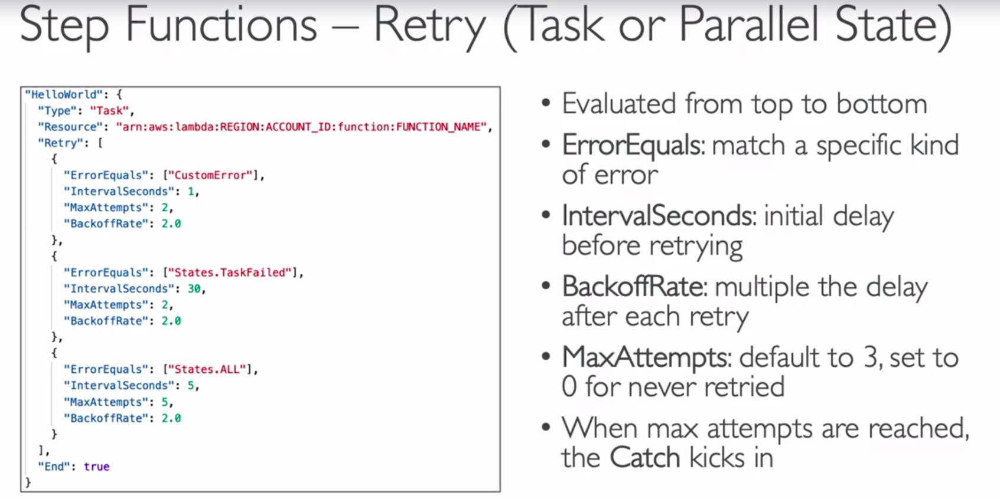
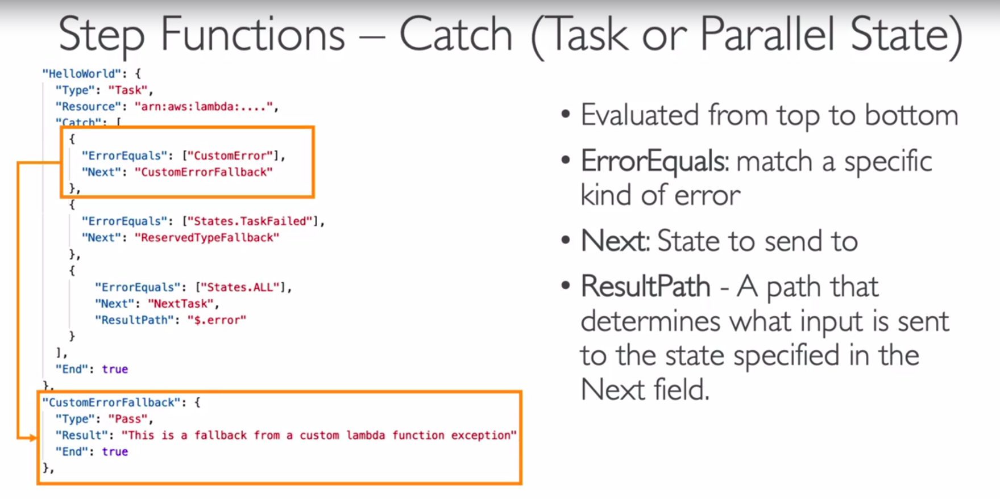
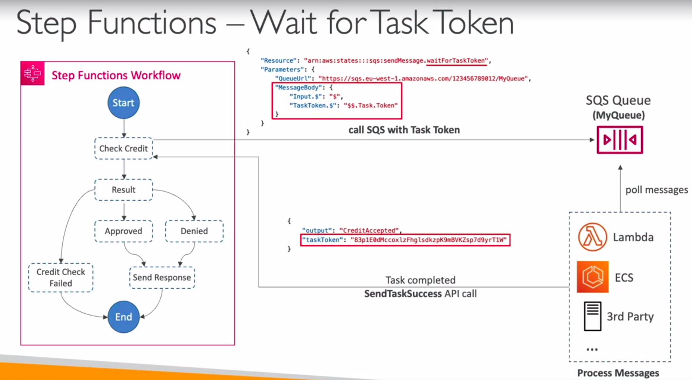
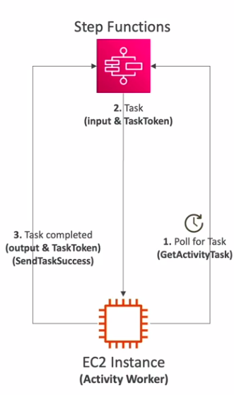
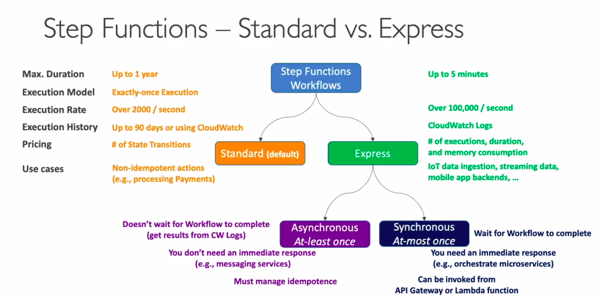

# AWS Step Functions:
- You can start Step Functions through SDK Call, API Gateway, Event Bridge (Cloud Watch Event).
- **Task State**: Do some work in your state machine    

- The following code includes a Task that invokes a lambda function

```json
{  
"StartAt":"CallLambda",
"States":{  
    "CallLambda":{  
        "Type":"Task",
        "Resource":"arn:aws:states:::lambda:invoke",
        "Parameters":{  
        "FunctionName":"arn:aws:lambda:us-east-1:123456789012:function:MyFunction"
        },
        "End":true
    }
}
}

```

## Error Handling in Step Functions:
- Any state can encounter runtime errors for various reasons:
    - State machine definition issues (example: no matching rule in a choice state)
    - Task failutres (Exception in lambda function)
    - Transient issues (network partition events)
- Use Retry (to retry failed state) and Catch (Transition to failure path) in the state machine to handle errors instead of inside the application code.
- Predefined error codes:
    - states.ALL: matches any error name:
    - states.Timeout: Task ran longer than the TimeoutSeconds or no heartbeat received
    - states.TaskFailed: execution failure
    - states.permissions: insufficient privileges to execute code
## Retry Error:

## Catch Error:

## Wait For Task Token:
- Allows you to pause Step Functions during a Task until a Task Token is returned.
- Task might wait for other AWS services, human approval, 3rd part integration, call legacy system..
- Append `.waitForTaskToken` to the `Resource` field to tell step functions to wait for the task token to be returned.


## Activity Tasks:
- Enables you to have the Task work performed by an Activity Worker
- Activity Worker apps can be running on EC2,Lambda, mobile device..
- Activity Worker poll for a Task using `GetActivityTask` API
- After Activity worker completes its work, it sends a response of its success/failure using sendTaskSuccess or SendTaskFailure.

    
## Standard vs Express:
- In Express Workflows we have the `Asynchronous` and the `Synchronous`
