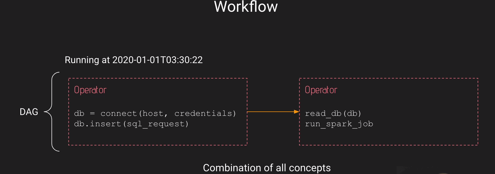

# Apache Airflow Introduction:
- Apache Airflow allow you to create reliable and powerful data pipelines in a distributed environment while monitoring your DAGs.
- In airflow everything is developed in python.
-  Airflow is an open source platfom to `programmatically author, schedule` and `monitor` workflows.
# Apache Airflow Componenets:
- **Web Server**: Flask Server with Gunicorn serving the UI.
- **Scheduler**: Daemon in charge of scheduling workflows.
- **Metastore**: Database where metadata are stored.
- **Executor**: Class defining how your tasks should be executed.
- **Worker**: Process/sub process `executing` your task.
# Core Concepts:
- **`DAG`**: Directed Acyclic Graph is the core concept of Airflow, collecting Tasks together, organized with dependencies and relationships to say how they should run.
- **Operator**: an object encapsulating the task, the job that you want to execute. Basically an operator is a task in your DAG, in your data pipeline.
    - Action operator: In charge of executing something. For example, you want to execute a python function you use the python operator, you want to execute a bash command you execute the bash operator (postgresql operator etc.)
    - Transfer Operator: In charge of transferring data from a source to a destination.
    - Sensor Operator: allows you to wait for something to hapen before moving forward, before getting completed. For example you want to wait your file to land on your filesystem you use file sensor.
- **Task instance**: is an instance of your operator in your DAG.
- **Workflow**: combination of all concepts give you a workflow.

- Airflow is not a data streaming solution neither a data processing framework. That means you should not process terabytes of data in your DAG.
- Configuring the scheduler:
    - **min_file_process_interval**: Number of seconds after which a DAG file is parsed. The DAG is parsed every x number of seconds.
    - **dag_dir_list_interval**: How often in seconds to scan directory for new files. Default to 5 minutes 
- Configuring the web server:
    - **worker_refresh_interval**: Number of seconds to wait before refreshing a batch of workers. default to 30 seconds.