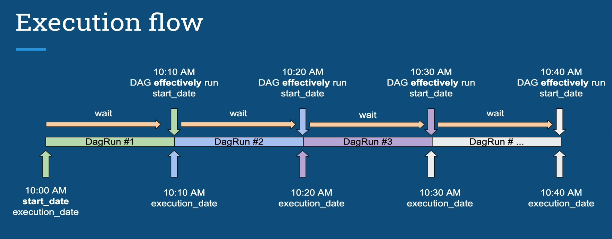

# Apache Airflow Introduction:
- Apache Airflow allow you to create reliable and powerful data pipelines in a distributed environment while monitoring your DAGs.
- In airflow everything is developed in python.
-  Airflow is an open source platfom to `programmatically author, schedule` and `monitor` workflows.
# Apache Airflow Componenets:
- **Web Server**: Flask Server with Gunicorn serving the UI.
- **Scheduler**: Daemon in charge of scheduling workflows.
- **Metastore**: Database where metadata are stored.
- **Executor**: Class defining how your tasks should be executed.
- **Worker**: Process/sub process `executing` your task.
# Core Concepts:
- **`DAG`**: Directed Acyclic Graph is the core concept of Airflow, collecting Tasks together, organized with dependencies and relationships to say how they should run.
- **Operator**: an object encapsulating the task, the job that you want to execute. Basically an operator is a task in your DAG, in your data pipeline.
    - Action operator: In charge of executing something. For example, you want to execute a python function you use the python operator, you want to execute a bash command you execute the bash operator (postgresql operator etc.)
    - Transfer Operator: In charge of transferring data from a source to a destination.
    - Sensor Operator: allows you to wait for something to hapen before moving forward, before getting completed. For example you want to wait your file to land on your filesystem you use file sensor.
- **Task instance**: is an instance of your operator in your DAG.
- **Workflow**: combination of all concepts give you a workflow.

- Airflow is not a data streaming solution neither a data processing framework. That means you should not process terabytes of data in your DAG.
- Configuring the scheduler:
    - **min_file_process_interval**: Number of seconds after which a DAG file is parsed. The DAG is parsed every x number of seconds.
    - **dag_dir_list_interval**: How often in seconds to scan directory for new files. Default to 5 minutes 
- Configuring the web server:
    - **worker_refresh_interval**: Number of seconds to wait before refreshing a batch of workers. default to 30 seconds.
# Airflow CLI commands:
- `airflow init db`: this initializes the metastore.
- `airflow db reset`: delete all metadata from the metastore.
- `airflow webserver`: runs the webserver of airflow
- `airflow scheduler`: runs airflow scheduler
- `airflow celery worker`: this command allows you to declare a machine as airflow worker
- `airflow dags list`: list dags
- `airflow dags trigger example_operator`
- `airflow tasks test dag_id task_id execution_date`: verify if your tasks work without checking its dependencies.
## What is a Dag?
```python
from airflow import DAG
from datetime import datetime, timedelta
default_args={ //these arguments are for your task
    "owner": "airflow",
    "email_on_failure":False,
    "email_on_retry": False,
    "email": "admin@localhost.com"
    "retries":1 //if a task fails then it will retry one time
    "retry_delay": timedelta(minutes=5) //wait 5 mins before retry
}
with DAG("dag_id", start_date=datetime(2021, 1, 1), schedule_interval="@daily", default_args=default_args, catchup=False) as dag:
//catchup will prevent running all the previous dag runs between the current date and the start date
```
## What is an Operator?
- `Operator = Task`:
- `Action Operator`: Allow you to execute something.
- `Transfer Operator`: Transfer data from source to destination.
- `Sensor Operator`: Allow you to wait for something to happen before moving to the next task.
## Airflow Practice:
- `airflow_plugins_folder`: refers to the directory where custom plugins can be placed. Plugins in Airflow provide additional functionalities and extend the core features of the platform. This folder is where you can store Python modules or packages that define custom operators, sensors, hooks, macros or other components to enhance the capabilities of your Airflow environment.
- `airflow_dags_folder`: refers to the directory where you can store your DAG files. DAGs are Python scripts that define the workflows and tasks to be executed by airflow. AIRFLOW monitors this folder for any changes and automatically detects and loads the new or modified DAG files.
```bash
airflow tasks test dag_id task_id execution_date(2021-01-01)
# Testing that the task work without storing any metadata in the metadatastore

```
- In order to create dependencies between tasks you have to use `set_downstream` and set_upstream(methods):
```python
task1.set_downstream(task2) # This will execute task1 and then task2
task2.set_upstream(task1)#This is exactly the same as the above
>> equivalent to set_downstream
<< equivalent to set_upstream
#In order to create dependencies with them it is as follows
task1 >> task2 >> task3 >> task4
```
- `.airflowignore`: as a best practice always put a .airflowignore file in your DAGs folder. it specifies the directories or files in the DAGs folder that Airflow should ignore.
- If you want to see the logs for your dag run you should exec into the airflow docker and then cd into `/logs/scheduler` in which you will find for each day a folder and the folder latest with the latest date. 
- `airflow run`: run a single task instance.
- `airflow list_dags`: list all dags.
- `airflow dag_state`: get the status of a DAG run.
- `airflow task_state`: Get the status of a Task instance.
- `airflow test`: Test a task instance without checking for dependencies or recording its state in the db.
## START DATE & SCHEDULE INTERVAL:
- `execution_date`
- `start_date`: can be set to a value in the past or future. If you set it to the futur the scheduler will wait for that date to come. If you set it to the past it will execute all the previous runs unless you specify the option `catchup: false`.

- `scheduling_interval`: can be Cron expressions(0 * * * *) or Timedelta objects (datetime.timedelta(days=1)). As a best practice you should use cron expressions rather than timedelta objects as specified in the documentation.

- `end_date`: the date at which your DAG/Task should stop being scheduled. Set to None by default.
```bash
airflow backfill -s 2023-01-20 -e 2023-01-25 --rerun_failed_tasks -B backfill
#-s specify the start date and the end date that you want to 
# --rerun_failed_tasks  allows you to rerun all failed tasks for the backfill date interval instead of raising expressions
# -B backfill it allows to run in backward meaning from recent dagruns to least recent.
```
## Timezone in Python:
- Python datetime.datetime objects with tzinfo attribute set: `Datetime aware`
- Python datetime.datetime objects without tzinfo attribute set: `Datetime naive` 
-> interpretation of naive datetime objects is bad
- Datetime information is stored in `UTC`.
- User interface always shows in datetime in UTC.
- Airflow uses the `pendulum` python library to deal with time zones.

## Create Dependencies on previous dagRuns:
- `depends_on_past`: defined at task level. If a previous task instance failed, the current task is not executed. Consequently the current task has no status. Only first task instance with start_date allowed to run.
- `wait_for_downstream`: Defined at task level or at the dag level in the default_args. An instance of task X will wait for tasks immediatly downstream of the previous instance of task x to finish successfully before it runs.

## Webserver architecture:

nb_workers = 2 *nb_cores + 1
## Dag Failure Detection:
- When you instantiate a dag you can specify all this parameters in order to check the execution of your dag run:
    - `dagrun_timeout`: how longer dagrun should be on before timeout so that new dagruns can be triggered.
    - `sla_miss_callback`: allows to call a function when reporting sla timeouts
    - `on_failure_callback`: call function when dagrun fails
    - `on_success_callback`: call function when dagrun succceeds

## Test you DAGs:
- `pytest`: testing framework that allow to create test suites.
- There are five categories of test for a DAG:
    - `DAG validation Tests`: check if valid (verify typos, contain cycles, check default args, high level of testing of DAGs -> it avoids having the message box on the UI telling you that your dag is broken)
    - `DAG/pipeline Definition Tests`: check total number of tasks, nature of tasks check the upstream and downstream dependencies of tasks.
    - `Unit tests`: check the logic
    - `Integration Tests`: test if tasks work well with each others using a subset of production data. check if tasks can exchange data, check the input of tasks, check the dependencies between multiple tasks.
    - `End to End pipeline tests`:check if the output is correct, check the full logic and performance. 


## Branching:
- When designing your data pipelines, you may encounter use cases that require more complex task flows than Task A > Task B > Task C. For example, you may have use case where you need to decide between multiple tasks to execute based on the results of an upstream task. Or you may have a case where part of your pipeline should only run under certain external conditions. Fortunately, Airflow has multiple options for building `conditional logic` and or `branching` in your DAGs.
- **`@task.branch`, `BranchPythonOperator`**: One of the simplest ways to implement branching in Airflow is to use `@task.branch` decorator which is a decorated version of `BranchPythonOperator`. This decorator accepts any python function as input as long as the function returns a list of valid IDs for Airflow tasks that the DAG should run after the functions completes.
```Python
result = 1
@task.branch
def choose_branch(result):
    if result > 0.5:
        return ['task_a', 'task_b']
    return ['task_c']

choose_branch(result)
```

- Note that with the `@task.branch` decorator, your Python function must return at least one task ID for whichever branch is chosen (i.e. it can't return nothing). If one of the paths in your branching should do nothing, you can use an EmptyOperator in that branch.
- **`@task.short_circuit`, `ShorCircuitOperator`**: This operator takes a python function that returns True or False based on logic implemented for your use case. If True is returned DAG continues, and if False is returned, all downstream tasks are skipped.
- `@task.short_circuit` is useful when you know that some tasks in your DAG should run only occasionnally. For example, maybe your DAG runs daily, but some tasks should only run on sundays.
```Python

@dag(
    start_date=datetime(2023, 1, 1),
    schedule="@daily",
    catchup=False,
)
def short_circuit_operator_decorator_example():

    @task.short_circuit
    def condition_is_True():
        return True

    @task.short_circuit
    def condition_is_False():
        return False

    ds_true = [EmptyOperator(task_id='true_' + str(i)) for i in [1, 2]]
    ds_false = [EmptyOperator(task_id='false_' + str(i)) for i in [1, 2]]

    chain(condition_is_True(), *ds_true)
    chain(condition_is_False(), *ds_false)


short_circuit_operator_decorator_example()
```


## Trigger rules for your tasks:

