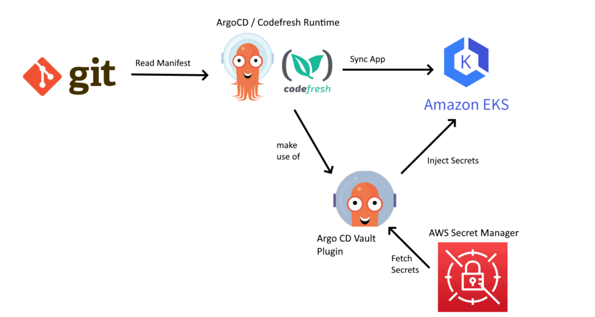

# Problematic
- Gitops is a set of best practices that expand the approach of using Git as the source of truth for Kubernetes configuration.
- Adopting GitOps in a kubernetes env comes with difficulties when it comes to secret management as organizations traditionnaly kept their secrets in external systems either on their cloud provider or on dedicated solutions such as Hashicorp Vault.
- The challenge is to use secret injection method with K8S deployment tools while still managing secrets in a secure and safe manner.
# Argo CD Vault Plugin:
- Extra add-on that allows ArgoCD to fetch secrets from external sources. this plugin works with `Hashicorp Vault`, `IBM Cloud secrets Manager`, `SOPS` and `AWS Secret Manager`.

1. Install ArgoCD Vault plugin
2. Define Secrets in AWS Secrets Manager
3. Setup a kubernetes application to retrieve secrets during deployment with Argo CD
