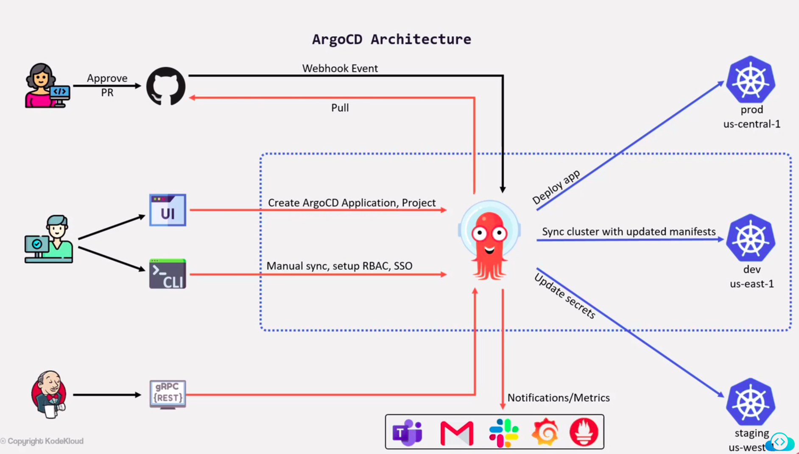

# ArgoCD Terminology

- `Application`: a group of kubernetes resources as defined by a manifest
- `Application source type`: The tool that is used to build the application (helm, kustomize, ksonnet)
- `Project`: Provide a logical grouping of applications, which is useful when ArgoCD is used by multiple teams.
- `Sync`: The process of making an application move to its target state.
- `Sync operation Status`: Whether or not an operation succeeded
- `Refresh`: Compare latest code in Git with live state. Figure out what is different
- `Health`: The health of the application, is it running correctly? can it serve requests?
  

# ArgoCD Installation Options

- **Multi tenant**: most common way and is typically used to serve multiple application developer teams in the organization and maintained by a platform team. End users can access ArgoCD via server using Web UI or argocd CLI. There are two types of this installation which are `High Availability` and `Non High Availability`.
- **Core**: This installation is primarly used to deploy ArgoCd in headless mode. This type of installation is most suitable for cluster administrators who independetly use ArgoCD and don't need multi-tenacy features. This bundle does not include the API server or UI, and installs the lightweight (non-HA) version of each component.

# ArgoCD Basics:

- **ArgoCD Application**: is a custom resource definition CRD and it includes two main information which are the `source` (git repo) and the `destination` where there resources should be deployed. The application also includes the `project` it belongs to and the `sync policy`
- **Reconcilation Loop**: tries to match the actual state of kubernetes cluster to the desired state. It is how much argocd will sync the desired state to the actual state. When using Webhook we can remove the delay and notify the argocd server directly to sync.
- Argocd has a default configuration to check the repo every 3 minutes and sync it.
