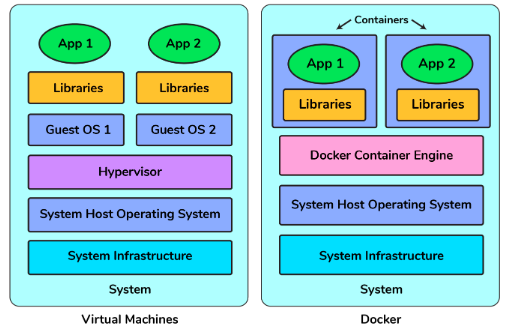
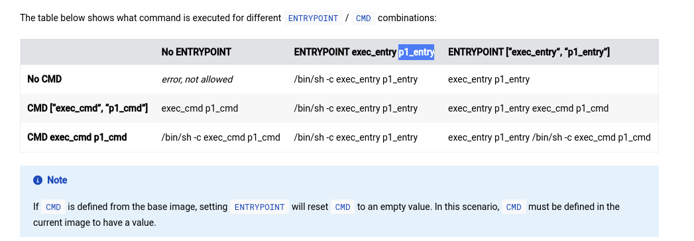

# Docker
- **Container**: Docker container doesn't require the isntallation of a seperate operating system, Docker just relies on the kernel's resources.

# Docker Architecture:
- Docker uses a client-server architecture. The Docker client talks to the docker daemon, which does the heavy lifting of building, and distributing your docker containers. The docker client and daemon can run on the same system or you can connect a docker client to a remote docker daemon. They communicate using REST API, over UNIX sockets or a network interface. Anoter Docker Client is `Docker compose`.
- **Docker daemon**: listens for Docker API requests and manages Docker objects such as images, containers, networks and volumes. A daemon can also communicate with other daemons to manage Docker services.
- **Docker client**: is the primary way that many Docker users interact with Docker. When we execute commands, the clients sends them to the daemon which carries them out. The client can communicate with more than one daemon.
- **Docker registries**: stores Docker images.
- **Container** is a runnable instance of an image. A container is defined by its image as well as any configuration options you provide to it when you create or start it.
- When running a container, it uses an isolated filesystem. This custom filesystem is provided by a container image. Since the image contains the container's filesystem, it must contain everything needed to run an application (dependencies, configurations, scripts, binaries, etc). 
# Best practices for writing Docker files
- If you want to improve the busild speed by excluding some files from the build-context, refer to exclude with `.dockerignore`.  
## Build Context
- If you attempt to build an image using Dockerfile from stdin without sending build context, then the build will fail if you use `COPY` or `ADD`.The following example illustrates this:
```conf
# create a directory to work in

mkdir examole ad example

# create an example file

touch somefile. txt

docker build -t myimage: latest -<<EOF
FROM busybox
COPY somefile.txt ./
RUN cat /somefile.txt
EOF

#observe that the build fails
...
Step 2/3 : COPY somefile.txt ./
COPY failed: stat /var/lib/docker/tmp/docker-builder249218248/somefile.txt: no such file or directory
```
- The example below uses the current directory `(.)` as the build context, and builds an image using a Dockerfile that is passed through stdin using a here document.
```conf
# build an image using the current dinectony as context, and a Dockerfile passed through stain
docker build -t myimage: latest -f-
. < <EOF
FROM busybox
COPY somefile. txt. 
EOF
```
- using `-f`option to specify the Docker file to use, using a hyphen `-` as filename to instruct Docker to read Dockerfile from stdin as follows:
```conf
docker build [OPTIONS] -f- PATH
```
- We can build an image using a remote Git repository as build context, Docker performs a git clone of the repository on the local machine and sends those files as build context to the daemon, this feature requires you to install `Git` on the host where you run docker build command. The commit history is not preserved. A repository is first pulled to a temporary directory on your local host. after that succeds the directory is sent to the Docker daemon as the context. Local copy gives you the ability to access private repositories using local user credentials, VPN's and so forth.
- The build context is the set of files located in the specified `PATH` or `URL` The build process can refer to any of the files in the context. For example, your build can use a `copy` instruction to reference a file in the context.
- THE `URL` parameter can refer to three kinds of resources: `Git repositories`, `pre-packaged tarball` contexts and `plain text files`.
-  Git URLs accept context configuration in their fragment section, separated by a colon `(:)`.The first part represents the reference that git will check out, and can be either a branch, a tag, or a remote reference. The second part represents a subdirectory inside the repository that will be used as build context.
```conf
docker build https://github.com/docker/nootfs.git#container:docker
```
- If you pass an URL to a remote tarball (archive distante), the url itself is sent to the daemon. The download operation will be performed on the host the dockerdaemon is running on, which is not necessarily the same host from which the build command is being issued
## Multi stage build
- allows you to drastically reduce the size of your final image, without struggling to reduce the number of intermediate layers and files.
- Because an image is built during the final stage of the build process, you can minimize image layers by leveraging build cache.
- If the build contains several layers and you want to ensure the build cache is reusable, you can `order them from the less frequently changed to the more frequently changed`.
```conf
# syntax=docker/dockerfile: 1
FROM golang:1.16-alpine AS build

# Install tools required for project
# Run docker build - -no-cache to update dependencies.
RUN apk add --no-cache git
RUN go get github.com/golang/dep/cmd/dep

# List project dependencies with Gopkg. tomI and Gopkg. lock
# These layers are only re-built when Gopkg files are updated
COPY Gopkg. lock Gopkg. toml / go/src/project/

WORKDIR /go/src/project/

# Install library dependencies
RUN dep ensure -vendor-only

# Copy the entire project and build it
# This layer is rebuilt when a file changes in the project directory

COPY . /go/src/project/

RUN go build -o /bin/project
# This results in a single layer image

FROM scratch
COPY --from-build /bin/project /bin/project
ENTRYPOINT [" /bin/project"]
CMD ["--help" ]
```
## Minimize the number of layers:
- Only instruction. `RUN`, `COPY`, `ADD` create layers. Other instructions, create **`temporary intermediate images`** and don't increase the size of the build.
- Prior to Docker version 1.10, it was recomended to combine all labels into a single `LABEL` instruction, to prevent extra layers from being created. This is no longer necessary, but combining labels is still suported.
- Split long or complex `RUN` statements on multiple lines separated with backslashes to make your dockerfile more readable, understandable and maintainable.
## Leverage Build Cache
- Starting with a parent image that's already in the cache, the next instruction compared against all child images derived from the base image to see if one of them was built using the exact same instruction. If not, the cache is invalidated.
- In most cases, simply comparing the instruction in the dockerfile with one of the child images is sufficient. However, certain instructions require more examination and explanation.
- For `ADD` and `COPY` instructions, the contents of each file in the image are examined and a `checksum` is calculated for each file. The last-modified and last-accessed times of each file aren't considered in these checksums. During the cache lookup, the checksum is compared against the checksum in the existing images.If anything has changed in any file, such as the contents and its metadata, then the cache is invalidated.
- Aside from the `ADD` and `COPY` commands, cache checking doesn't look at the files in the container to determine a cache match. For Example, when processing `Run apt-get -y update` command the files updated in the container aren't examinated to determine if a cache hit exists. In that case just the command string itself is used to find a match.
```conf
# syntax=docker/dockerfile:1
FROM ubuntu:18.04
RUN apt-get update
RUN apt-get install -y curl
****
# syntax=docker/dockerfile:1
FROM ubuntu:18.04
RUN apt-get update
RUN apt-get install -y curl nginx
#This technique is knwon as Cache Busting
RUN apt-get update && apt-get install -y \
    package-bar \
    package-baz \
    package-foo=1.3.*
```
- Docker sees the initial and modified instructions as identical and reuses the cache from previous steps. As result the `apt-get update` isn't executed because the build uses the cached version. Because the `apt-get update` isn't run, your build can potentially get an outdated version of the `curl` and nginx packages.
```conf
RUN wget -O - https://some.site | wc -l > /number
```
- Docker executes these commands using the /bin/sh -c interpreter, which evaluates the code of the last operation in the pipe to determine success. In the example above, the build step succeds and produces a new image as long as `wc -l` command succeeds even if the `wget` command fails.
- If you want the command to fail due to an error at any stage in the pipe preprend `set -o pipefail &&`
```conf
RUN set -o pipefail && wget -O - https://some.site | wc -l > /number
```
- When you create a ENV variable using `ENV ADMIN_USER="mark"` it will be created in intermediate layer. This means even if you unset the env variable in a future later, it still persists in this layer and its value can be dumped.
- To prevent this and really unset the environment variable use a RUN command with shell commands to set, use and unset the variable all in a single layer.
```conf
# syntax=docker/dockerfile:1
FROM alpine
RUN export ADMIN_USER="mark" \
    && echo $ADMIN_USER > ./mark \
    && unset ADMIN_USER
CMD sh
```
- Unlike an `ARG` instruction, `ENV` values are always persisted in the built image.
## ADD or COPY
- Although `ADD` and `COPY` are functionally similar, generally speaking `COPY` is preferred. that's because it's more transparent than `ADD`. `COPY` only supports the basic copying ol local files into the container, while `ADD` has some features like local-only tar extraction and remote URL support that are not immediately obvious. Consequently, the best use for `ADD` is `local tar file auto-extraction` into the image, as in `ADD rootfs.tar.xz / .`.
- Because the image size matters, using `ADD` to fetch packages from remote URLs is strongly discouraged; you should use `curl` or `wget` instead. That way you can delete the files you no longer need after they have been extracted and you don't have to add another layer in your image.
- If a service can run without privileges, use USER to change to a non-root user. Start by creating the user and group in the Dockerfile with something like `RUN groupadd -r postgres && useradd --no-log-init -r -g postgres postgres`.
## ENTRYPOINT
- `ENTRYPOINY`: should be defined when using the container as executable.
- `CMD`: should be used as a way of defining default arguments for an `ENTRYPOINT` command or for executing an ad-hoc command in a container.
- `CMD`: will be overriden when running the container with alternative arguments

## WORKDIR
- The workdir instruction can be used multiple times in a `Dockerfile`. If a relative path is provided, it will be relative to the path of the previous `WORKDIR` instruction. For example:
```conf
WORKDIR /a
WORKDIR b
WORKDIR c
RUN pwd
```
- The output of the final pwd command in this Dockerfile would be `/a/b/c`.
- If not specified, the `default working directory` is `/`.
## USER
- The default user in docker exec is the same user used to start the container which can be set in docker run or your compose file.
- If you don't explicitly set the user when starting the container, it will default to the user configured in the image, you can inspect the image to look this up. This is configured by the last USER line in the Dockerfile. it may also be configured by a parent image specified by the FROM line.
- If neither the image, nor the run command specifies a user, docker defaults to `root`, `uid 0`.
- By default, containers run as root. A container running as root has full control of the host system. It is dangerous to use root user so your image should specify `USER` instruction to specify `non-root` user for containers to run as.
# Security Best Practices:
- When building an image from Dockerfile, ensure that you use a minimal base image that matches your requirements. A smaller image not only offers portability and faster download but it also reduces the risk of vulnerabilities inroduced through dependencies.
- **Multi-stage builds**: instead of images based on other images, multi stage allows you to pick your artifacts without inheriting vulnerabilities of base images on which you rely on.
- When building your docker images consider the following best practices:
    - Each container should only have one responsibility.
    - Containers should be immultable, lightweight and fast.
    - Avoid installing unecessary packages. This keeps the image clean and safe.
- If you want have multiple images that have a lot in common, consider creating your own base image. 
- To keep your production image lean but allow for debugging, consider using it as the base image for debug image. Additional testing and debugging tooling can be added on top of the production image.