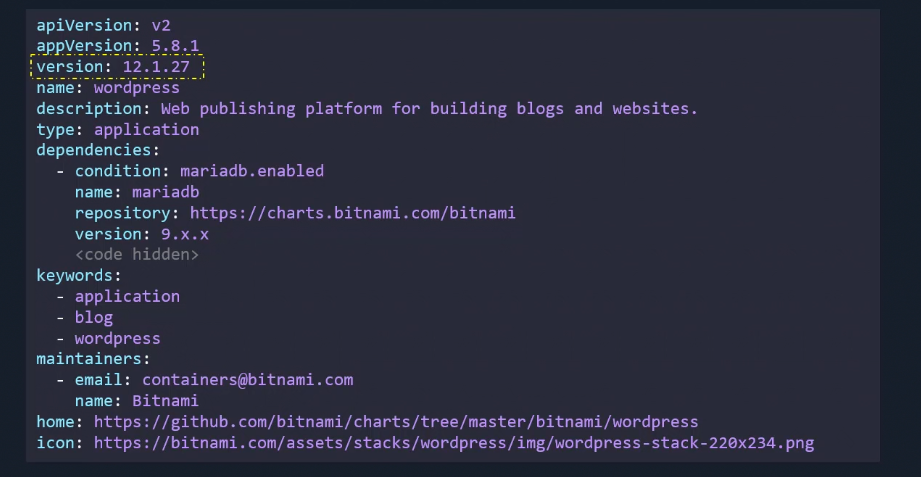
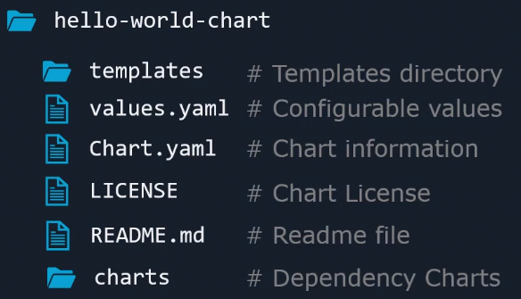

## What is Helm?
- Helm is often described as the Kubernetes package manager, but it's much more than that. It simplifies the process of defining, installing, and upgrading even the most complex Kubernetes applications. Think of it as the `apt/yum/homebrew` for Kubernetes. Helm packages are called charts, which are pre-configured Kubernetes resources that can be deployed as a single unit. Here's why Helm is essential:
    - **Simplifies Kubernetes Deployments**: Helm charts package up applications into pre-configured Kubernetes resources, making deployments reproducible, scalable, and manageable.
    - **Manages Dependencies**: Helm charts can define dependencies on other charts, allowing complex applications to be composed from separate, independent components.
    - **Streamlines Updates and Rollbacks**: Helm makes it easy to update or rollback deployed applications to an earlier version, enhancing deployment flexibility and operational safety.
- Here are some of the most commonly used Helm commands:
```sh
$ helm install my-release bitnami/wordpress # Deploys a WordPress site named 'my-release'
$ helm upgrade my-release bitnami/wordpress # Upgrades the deployed application
$ helm rollback my-release 1 # Rolls back 'my-release' to its first version
$ helm uninstall my-release # Removes 'my-release' from the cluster
```
## Helm 2 vs Helm 3
- The transition from Helm 2 to Helm 3 introduced significant changes and improvements: 
    - **Removal of Tiller**: In Helm 2, Tiller played a central role by running inside your Kubernetes cluster as a manager for Helm charts. This posed several security concerns due to its broad access. Helm 3 eliminates Tiller, adopting a client-only architecture that enhances security and simplifies operations.

    - **Secrets as the Default Storage Driver**: Helm 3 uses Kubernetes secrets for storing release information by default, replacing the ConfigMaps used in Helm 2. This change improves security and release management.

    - **Improved Upgrade Strategy with 3-Way Strategic Merge Patch**: Helm 3 introduces a more sophisticated upgrade process that compares the previous chart's manifest, the current chart's manifest, and the live state of the cluster. This approach helps manage manual and automated changes more effectively.

    - **Namespace Scoped Releases**: In Helm 2, releases were stored globally across namespaces. Helm 3 changes this by making releases namespace-specific, which aligns better with Kubernetes' security model and allows for duplicate release names across different namespaces.

    - **Simplified Chart Dependency Management**: Helm 3 incorporates Chart dependencies directly in the `Chart.yaml` file, eliminating the need for a separate `requirements.yaml` and streamlining the chart management process.
    
    - **Enhanced Security Model**: With the removal of Tiller and the move to namespace-scoped releases, Helm 3 offers a more secure environment by default. The introduction of chart signing and verification further improves security.


## Helm Components
- A release is a single installation of an application using helm chart. 
- Within each release, you can have multiple revisions. Each revision is like a snapshot of the application.
- Helm saves the state of our releases in the kubernetes Cluster as a secret. 
- When a chart is installed in your cluster, a release is created.

``` sh
helm install my-site bitnami/wordpress #This creates a release named my-site
```


- in the `chart.yaml` file the **appVersion** tracks the **version** of the application while the version tracks the version of the chart itself.
- In the `chart.yaml` file if apiVersion is v1 then we are using helm2 and any additional field that was introduced in v2 of the apiVersion will be ignored.
- **type** Field can have two values which are `application` or `library`. Application is the default type while library is type of chart that provides utility in building charts.
- **Dependencies** Field includes the list of chart dependencies.
- **Keywords** field helps in searching for the helm chart in a public repository.



## Useful Commands:

```sh
$ helm search hub wordpress #search a chart, it expects where to search (hub: artifcat hub, repo: to search in a specific repo)

$ helm repo add bitnami https://charts.bitnami.com/bitnami # add a repository to your repositories

$ helm list #list all releases

$ helm uninstall my-release # Deletes release and all the k8s objects

$ helm install --set wordpressBlogName="Helm Tutorials" my-release bitnami/wordpress

$ helm install --values custom-values.yaml my-release bitnami/wordpress

$ helm pull bitnami/wordpress #Downloads the chart in archived form

$ helm pull --untar bitnami/wordpress #Downloads the chart and unarchive it

$ helm install my-release ./wordpress #install the chart installed locally

$ helm history release-name #gets history of different stages of the release

$ helm rollback nginx-release 1 # rollback to revision 1, technically it goes to revision 3 which has same config as revision 1 
```
## Best Practices:
- use `.helmignore` to exclude unecessary files or directories from chart package, optimizing the chart's size and deployment time.
- Try using signed charts to ensure the integrity and origin of charts. 
- Charts can be scanned before deployment using tools like `trivy` or `Snyk`.
- `Helm test` is command that allows to run tests defined in the chart to verify that the application is running as expected after its deployment. Tests are written using `Helm Hooks`.
- To set your own Helm repository use tools like `Harbor` or `ChartMusuem`.
## To Study
- Helm Plugins: How they extend helm functionality?
- Compare Helm to Skaffold and Kusotmize? when to use each one?
- What are different strategies for managing Helm release upgrades, especially for stateful applications or complex deployments?

- **Helm Docs**: 
   - [Helm Official Documentation](https://helm.sh/docs/)
