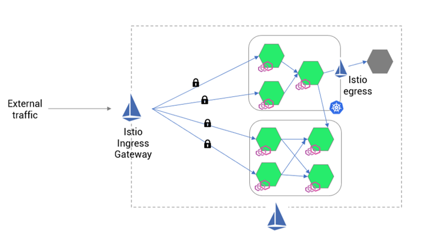

# Service Mesh

instead of having all different requirements (Authentication, Authorization, Networking, Logging, Monitoring, Tracing) in each microservice we replace with a single proxy in the form a sidecar container.


- A Service Mesh is a dedicated and configurable infrastructure layer that handles the communication between services without having to change the code in a microservice architecture.
- a service mesh offers: **Traffic Management**, **Security**, **Obersvability**, and **Service Discovery** (Health Checks, Load Balancing and Discovery)

# Istio

- Free and open source service mesh that offers a secure way to connect and monitor services.


- **Citadel**: Manages certificate generation
- **Pilot**: Help with service discovery
- **Galley**: help validating configuration
- all these three were combined into a single daemon called **istiod**
- Each service has another component called **Istio Agent** responsible for passing configuration secrets to the envoy proxy

- In order to allow Istio to automatically add the sidecar container envoy for each pod we need to add the labed `istio-injection=enabled` to that namespace.

  `kubectl label namespace default istio-injection=enabled`

- In order to validate Istio configuration we need to run:
  `istioctl analyze`

## Gateways in Istio:

- **Gateways**: are load balancers that sit at the edge of the mesh. they are the main configuration that manage the inbound and outbound traffic to service mesh. This is the recommended approach rather than using the kubernetes ingress.
- Istio manages ingress using envoy proxy as standalone for egress and ingress traffic

```python
apiVersion: networking.istio.io/v1alpha3
kind: Gateway
metadata:
  name: my-gateway
  namespace: some-config-namespace
spec:
  selector:
    app: my-gateway-controller
  servers:
  - port:
      number: 80
      name: http
      protocol: HTTP
    hosts:
    - uk.bookinfo.com
    - eu.bookinfo.com
    tls:
      httpsRedirect: true # sends 301 redirect for http requests
  - port:
      number: 443
      name: https-443
      protocol: HTTPS
    hosts:
    - uk.bookinfo.com
    - eu.bookinfo.com
    tls:
      mode: SIMPLE # enables HTTPS on this port
      serverCertificate: /etc/certs/servercert.pem
      privateKey: /etc/certs/privatekey.pem
```

- A Gateway provides more extensive customization and flexibility than Ingress, and allows Istio features such as monitoring and route rules to be applied to traffic entering the cluster.

- **Kubernetes NGINX Ingress**:
  - works only on layer 7 and does not support layer 4 and 5
  - Nginx ingress is slow catering multiple requests per second
  - poor capability in terms of observability and telemetry
- **Istio Ingress**:
  - Envoy proxy supports L3/L4 and L7 layers and this proxy is used for istio ingress
  - Istio offers both ingress controller and gateway.
  - rate limiting
  - circuit breaking
  - failover
  - since istio ingress uses envoy, you can manipulate HTTP headers for requests and responses via envoy
  - offers extensive telemetry and observability options
    

## Virtual Service:

- Virtual service can be bound to a gateway to control the forrwarding of traffic arriving at a particular host or gateway port.

```yaml
apiVersion: networking.istio.io/v1alpha3
kind: VirtualService
metadata:
  name: reviews-route
spec:
  hosts:
    - reviews.prod.svc.cluster.local
  http:
    - name: "reviews-v2-routes"
      match:
        - uri:
            prefix: "/wpcatalog"
        - uri:
            prefix: "/consumercatalog"
      rewrite:
        uri: "/newcatalog"
      route:
        - destination:
            host: reviews.prod.svc.cluster.local
            subset: v2
    - name: "reviews-v1-route"
      route:
        - destination:
            host: reviews.prod.svc.cluster.local
            subset: v1
```

- a subset/version of a route destination is identified with a reference to a named service subset which must be declared in a corresponding `DestinationRule`.
- subsets are defined in destination rule
- In normal cases, traffic is routed in a round robbin way. to change this behavior we can use `trafficPolicy.loadBalancer.simple: passthrough` which will redirect traffic to the host with fewer active requests


```yaml
apiVersion: networking.istio.io/v1alpha3
kind: DestinationRule
metadata:
  name: reviews-destination
spec:
  host: reviews.prod.svc.cluster.local
  subsets:
    - name: v1
      labels:
        version: v1
    - name: v2
      labels:
        version: v2
```

## h2load

this tool can be used to simulate concurent connections
`$ h2load -n100000 -c100 -m10 https://localhost`

- `-n`: number of requests
- `-c`: number of clients
- `-m`: max concurent streams to issue per client
