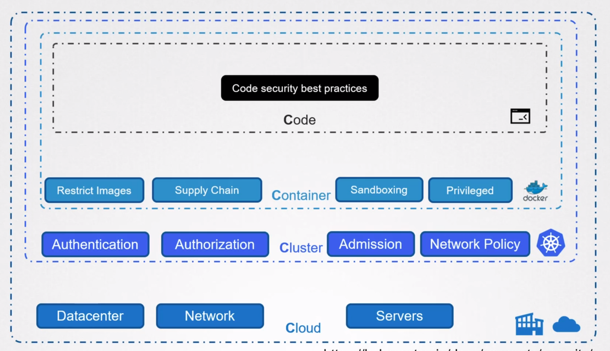
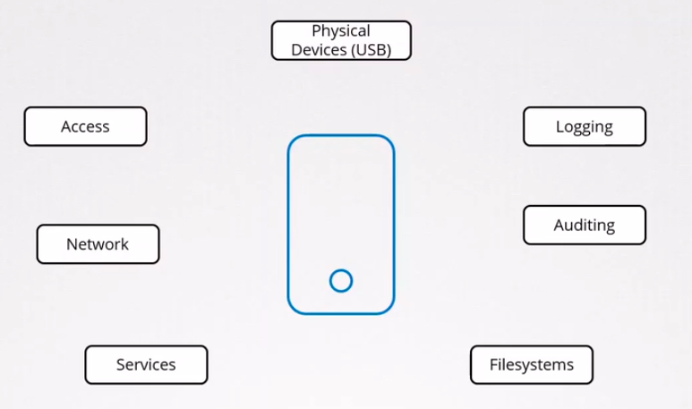

# Kubernetes Attack Surface:

- **4C's of Cloud Native Security**:
  - `Cloud`: The cloud itself can be attacked when it enables access to cluster from anywhere. If firewalls where in place then we would have blocked access.
  - `Cluster`: The attacker gained access to the cluster through the docker daemon that was exposed publically withouth authentication and authorization mechanisms.
  - `Container`: The attacker was able to run a priviledged container which should have been prevented. The attacker was also able to install utilities like curl.
  - `Code`: Code refers to the application code itself. Hardcoding credentials to access database or using environment variables to store them is a security vulnerability or exposing application without TLS are all bad coding practices.
    

## CIS Benchmarks:

- **Security Benchmark**:  
   - There are a lot of tools to asses our servers and one of them is `CIS Center for Internet Security` and it is a community driven non profit organization. - `CIS-CAT Lite`: this tools compares the current configuration of the cluster against the best practices and publishes a report in HTML format. - `Kube-bench` of `Aqua Securityx   `

## Kubelet Security:

- Kubelet serves on two ports:
  - `10250`: Serves API that allows full access.
  - `10255`: Serves API that allows unauthenticated read-only access.
- By default, kubelet allows all unauthenticated users to call its apis and this behavior can be changed by setting the flag `--anonymous-auth=false` in `kubelet.service` or in the `kubelet-config` file.
- **Authentication**:
  - `Certificate X509`: In order to do this you have to pass `--client-ca-file=/path/to/ca.crt` and in the curl command you have to now pass `--key` and `--cert`
  - `API Bearer Token`:
- **Authorization**: The default authorization mode is `--authorization-mode=AlwaysAllow` and to change this behavior we have to change the value to `authorization-mode=webhook`
- In order to disable access to `/metrics` endpoint and read only endpoints you have to set the flag `--read-only-port=0`

## Kubernetes dashboard Authentication:

- There are two options to login, either using a `Token` or through `Kubeconfig`
- In order to authenticate using token you should create a `Service Account` and give that SA the necessary access using RBAC

## Verify Platform Binaries before deploying:

- Verify that the kubernetes binaries downloaded are correct by checking the cheksum of each file and comparing it to the ones available
- Create the `sha512 hash` of the downloaded file by running the following command on MacOS:

  ```
  // MacOS
  shasum -a 512 kubernetes.tar.gz

  //Linux
  sha512sum kubernetes.tar.gz
  ```
