# Kubernetes Attack Surface:

- **4C's of Cloud Native Security**:
  - `Cloud`: The cloud itself can be attacked when it enables access to cluster from anywhere. If firewalls where in place then we would have blocked access.
  - `Cluster`: The attacker gained access to the cluster through the docker daemon that was exposed publically withouth authentication and authorization mechanisms.
  - `Container`: The attacker was able to run a priviledged container which should have been prevented. The attacker was also able to install utilities like curl.
  - `Code`: Code refers to the application code itself. Hardcoding credentials to access database or using environment variables to store them is a security vulnerability or exposing application without TLS are all bad coding practices.
    

## CIS Benchmarks:

- **Security Benchmark**:  
  
- There are a lot of tools to asses our servers and one of them is `CIS Center for Internet Security` and it is a community driven non profit organization. - `CIS-CAT Lite`: this tools compares the current configuration of the cluster against the best practices and publishes a report in HTML format. - `Kube-bench` of `Aqua Securityx   `
- `kube-bench run --targets master --check 1.3.2`

## Kubelet Security:

- Kubelet serves on two ports:
  - `10250`: Serves API that allows full access.
  - `10255`: Serves API that allows unauthenticated read-only access.
- By default, kubelet allows all unauthenticated users to call its apis and this behavior can be changed by setting the flag `--anonymous-auth=false` in `kubelet.service` or in the `kubelet-config` file.
- **Authentication**:
  - **Generating Certificate for a new Cluster Admin Process**:
    - `openssl genrsa -out jane.key 2048`
    - `openssl req -new -key jane.key -sub "/CN=jane" -out jane.csr`
    - create the CSR object by specifying the `groups` to which user belong, the `usages` and a base64 encoded certificate that we just generated under `request` field.
    - `kubectl certificate approve jane`
  - `Certificate X509`: In order to do this you have to pass `--client-ca-file=/path/to/ca.crt` and in the curl command you have to now pass `--key` and `--cert`
  - `API Bearer Token`:
- **Authorization**: The default authorization mode is `--authorization-mode=AlwaysAllow` and to change this behavior we have to change the value to `authorization-mode=webhook`
- In order to disable access to `/metrics` endpoint and read only endpoints you have to set the flag `--read-only-port=0`

## Kubernetes dashboard Authentication:

- There are two options to login, either using a `Token` or through `Kubeconfig`
- In order to authenticate using token you should create a `Service Account` and give that SA the necessary access using RBAC

## Verify Platform Binaries before deploying:

- Verify that the kubernetes binaries downloaded are correct by checking the cheksum of each file and comparing it to the ones available
- Create the `sha512 hash` of the downloaded file by running the following command on MacOS:

  ```
  // MacOS
  shasum -a 512 kubernetes.tar.gz

  //Linux
  sha512sum kubernetes.tar.gz
  ```

## System Hardening Commands

- `usermod -s /bin/nologin michale`: disable user account (usermod is used to change info about user)
- `userdel bob`: remove a user account
- `groupdel devs`: delete the group named devs
- `deluser michael admin`: remove user michael from admin group
- `id michael`: get info about user
- `who`: get info about logged in user
- `last`: get info about latest connected users
- `passwd david`: change david password (Run as Root)
  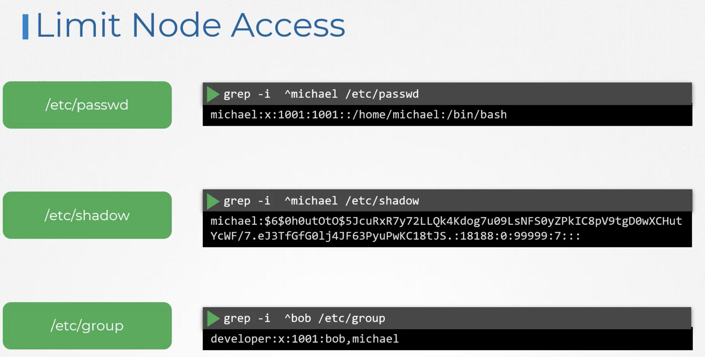
- `useradd -m -d /opt/sam -u 2328 -g admin -s /bin/bash sam`: Create a user with a specific userid, group, home directory and shell
- To Remove Root access: `vi /etc/ssh/sshd_config`: `PermitRootLogin no` This way no one can access the machine as root account.
- To disable password authentication: `vi /etc/ssh/sshd_config`: `PasswordAuthentication no`
- After each change of the /etc/ssh/sshd_config we have to run: `systemctl restart sshd`
- In order to allow a user to use the `sudo`: you have to add him in the `/etc/sudoers`

  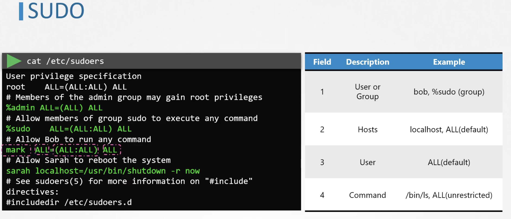

- To disable login to root user we have to set a nologin in `/etc/passwd`: grep -I ^root /etc/passwd
- `ssh-copy-id`: is used for setting up paswordless SSH login by copying the public ssh key to a remote machine authorized keys file. `ssh-copy-id -i ~/.ssh/id_rsa.pub jim@node01`
- To configure the user to run sudo commands without typing a password each time add this line in /etc/sudoers `jim ALL=(ALL) NOPASSWD:ALL`
- `systemctl list-units --type service`: to list all running services
- `modprobe pcspkr`: load the pcspkr kernel module
- `lsmod`: list all kernel modules
- In order to blacklist a kernel module (sctp) of being loaded you can add an entry to `/etc/modprobe.d/blacklist.conf`: `blacklist sctp`
- To check if a port is open we can use:
  - `apt install net-tools`: in order to install netstat
  - `netstat -natp | grep -w LISTEN`
  - `cat /etc/services | grep -w 53`: check in what service port 53 is used
  - `ls -l /proc/22797/exe`: check where the file is located
  - `rm -f /usr/bin/app1`: remove file
  - `kill -9 22797`: kill that port
  - `apt list --installed`: list all installed packages
  - `/lib/systemd/system/`: contain the unit files of services
  - `lsof -i :8080` check if port 8080 is open or not

## UFW: Uncomplicated Firewall

- install ufw:

```bash‡
apt-get update
apt-get install ufw
systemctl enable ufw
systemctl start ufw
```

- Define rules using ufw:

```bash
ufw status #Check ufw status
ufw default allow outgoing #allow all outgoing connection
ufw default deny incoming #deny all incoming connections
ufw allow from 172.16.238.5 to any port 22 proto tcp
ufw deny 8080 #block all connections to port 8080
ufw enable #Run this command when all rules are defined
ufw allow starting_port:ending_port/protocol #To use a port range
ufw disable #disable firewall but keep all rules
```

## Tracing syscalls:

```bash
strace touch /tmp/error.log #show all the syscalls done by the command touch
pidof etcd #Returns the pid of a running process (etcd)
strace -p 3596 #Keeps track of all calls done by the process with 3596 pid
```

- Run Tracee as docker container:

  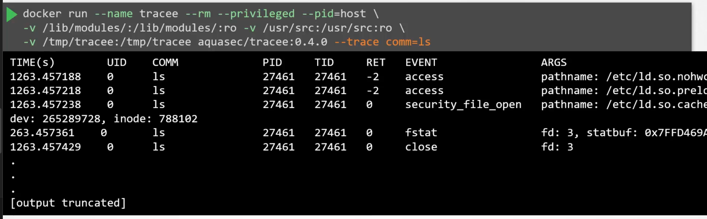

- We can check which syscalls are made by `new processes` by using `--trace pid=new`
- We can check which syscalls are made by `new container` by using `--trace container=new`
- `seccomp` stands for secure computing
- To check if seccomp is supported by your kernel: `grep -i seccomp /boot/config-$(uname -r)`
- Seccomp Modes:
  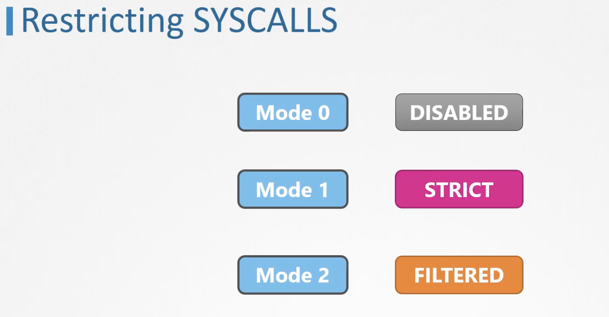
- In order to use such Restrictive Seccomp Mode all used syscalls have to be defined:
  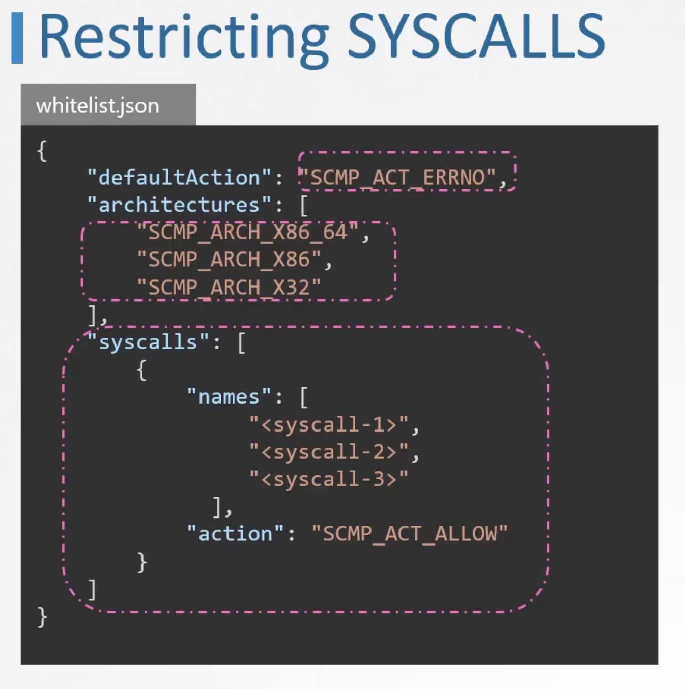
- To use different seccomp rules when running docker:

  ```bash
  docker run -it --rm --security-opt seccomp=/path/rules docker/whalesay /bin/sh
  docker run -it --rm --security-opt seccomp=unconfined docker/whalesay /bin/sh #allow everything
  ```

- Kubernetes does not implement seccomp by default which is why if we check we will find that seccomp is disabled
  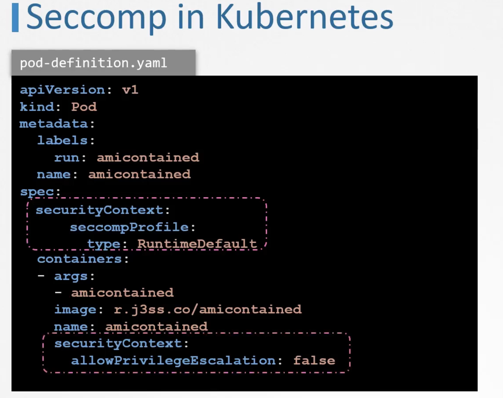
- If you want to use a seccomp profile that is on localhost you have to type `localhostProfile`. keep in mind the path is relative to `/var/lib/kubelet/seccomp`:
  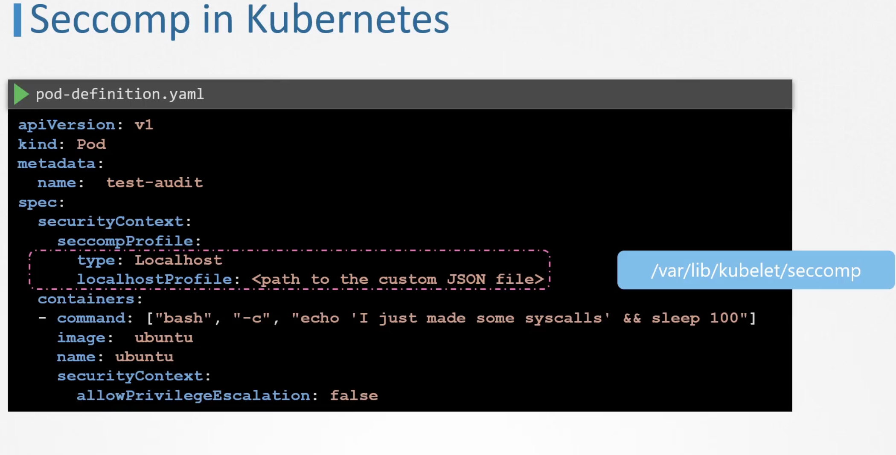

## AppArmor

- Check if apparmor is installed: `systemctl status apparmor`
  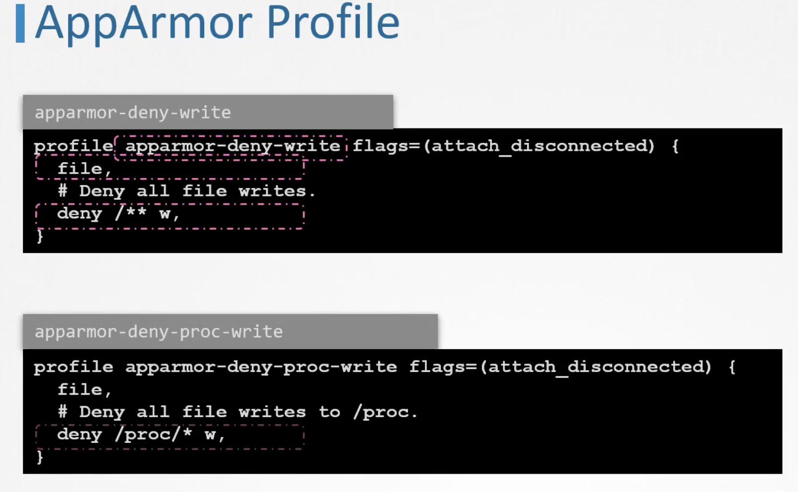
- Check apparmor profiles and modules that are loaded: `aa-status`
- apparmor profiles can be loaded in 3 modes: `enforce`, `complain` and `unconfined`
- `apt-get install -y apparmor-utils`: to be able to use `aa-genprof` command which we will use to create profiles.
- `aa-genprof /root/add_data.sh`: this command expects that the shell script add_data.sh is run from a different window so it cas scan for events.
- `apparmor_parser /etc/apparmor.d/root.add_data.sh`: to load a profile
- `ln -s /etc/apparmor.d/root.add_data.sh /etc/apparmor.d/disable`: to disable a profile
- Support for AppArmor was introduced in K8S version 1.4, and for it to work the AppArmor Kernel Module Enabled.
  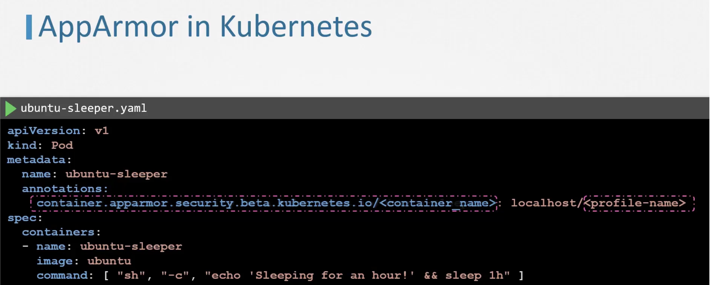
- To check what linux capabilities are needed when executing a command: `getcap /usr/bin/ping`
- To check what linux capabilities are used by a process using PID: `getpcaps PID`

# Minimize microservices vulnerabilities:

## Security context:

- If you define the security settings at the level of the pod and and the level of the container then the container settings will overide pod settings.
- Capabilities are only supported at the container level and not the pod level.

## Admission Controllers:

- in order to check the enabled admission controllers you have to run:
  ```bash
  kubectl exec kube-apiserver-controlplane -n kube-system -- kube-apiserver -h | grep enable-admission-plugins
  ```
- The `NamespaceLifecycle` admission controller will make sure that requests
  to a non-existent namespace is rejected and that the default namespaces such as
  default, kube-system and kube-public cannot be deleted.

## Pod Security Policy (PSP removed in v1.25):

- it is an admission controller that validates the pod against a set of rules.

  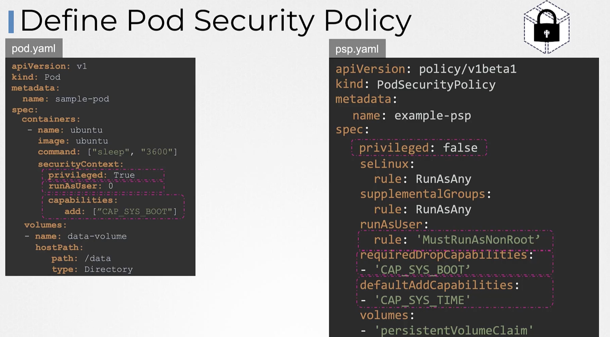

- it was deprecated in v1.21 and removed in v1.25 and `Pod Security Admission` and `Pod Security Standards` were introduced.

## PSA and PSP:

- Check that `PodSecurity` is part of the enabled admission plugins.
- 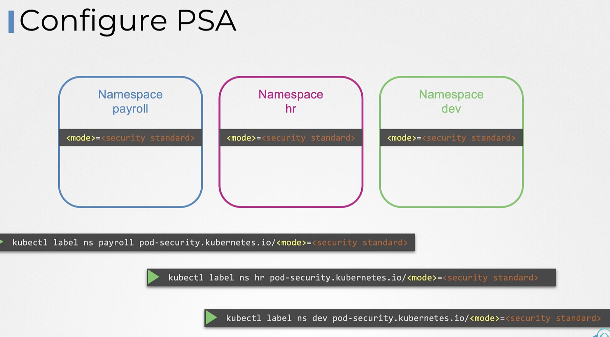
- 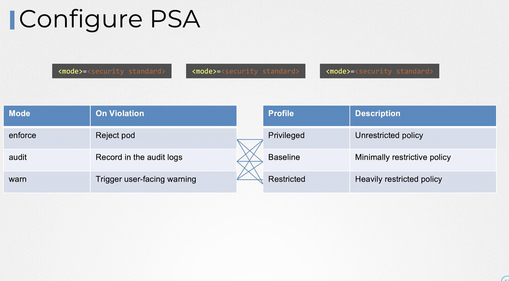
- `Kyverno`, `OPA/GATEkeeper`, `Open Policy Agent OPA` and `jsPolicy` are projects that are part of kubernetes ecosystem that replaced PSP
- In a Kubernetes cluster, the cluster administrator can specify the configuration file path for the admission configuration resource in the API server using the `--admission-control-config-file` flag.
- Admission Configuration example:

```yaml
apiVersion: admissionregistration.k8s.io/v1
kind: AdmissionConfiguration
plugins:
  - name: PodSecurity
    configuration:
      apiVersion: pod-security.admission.config.k8s.io/v1
      kind: PodSecurityConfiguration
      defaults:
        enforce: baseline
        enforce-version: latest
        audit: restricted
        audit-version: latest
        warn: restricted
        warn-version: latest
      exemptions:
        usernames: []
        runtimeClassNames: []
        namespaces: [my-namespace]
```

## OPA:

- by default OPA runs at port 8181, and by default authentication and authorization mechanisms are disabled.
- In order to load policies to opa we have to define policies in `rego` as follow:
  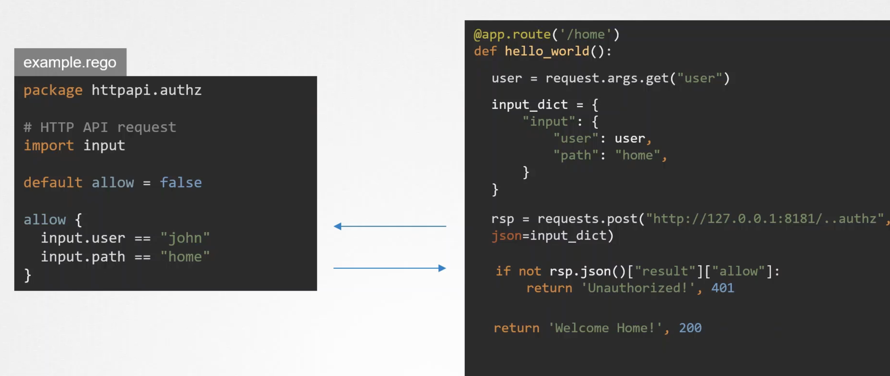

## OPA Gatekeeper:

- `kube-mgmt` automatically discovers policies and JSON data stored in ConfigMaps in Kubernetes and loads them into OPA.

## Encrypting Secrets at Rest:

- `apt-get install etcd-client`: install etcdctl

```bash
ETCDCTL_API=3 etcdctl --cacert=/etc/kubernetes/pki/etcd/ca.crt
--cert=/etc/kubernetes/pki/etcd/etcd/server.crt
--key=/etc/kubernetes/pki/etcd/server.key
get /registry/secrets/default/my-secret
```

## Container Sanboxing:

- `Sandboxing` in security refers to any technique that isolates something from the rest of the system.
- `gVisor` introduces a new layer between the container and the kernel. This measure is done in order to prevent the containers from directly making system calls to the kernel.
  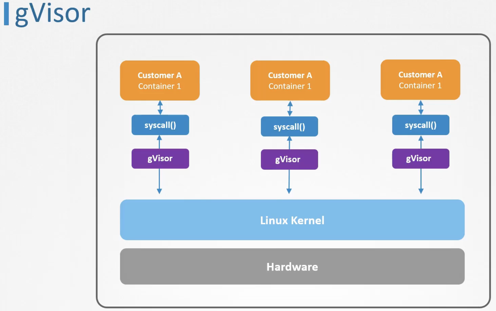
- `Kata Containers`: is about running each container in a separate Light weight virtual machine. In Cloud providers we will need to run nested virtualization in order to use kata containers.
  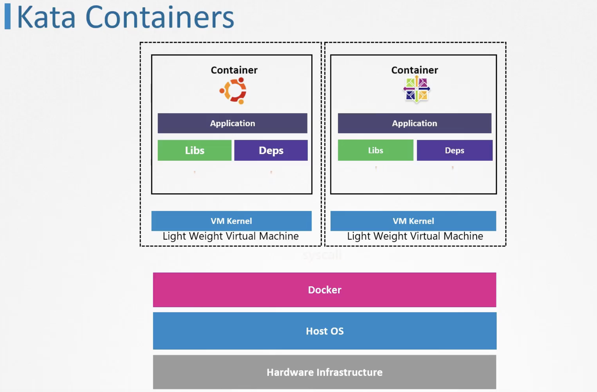
- `Container Runtime`:
  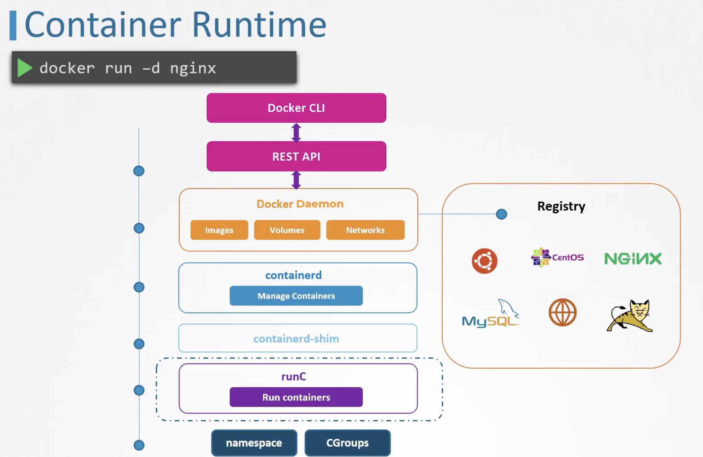
- We can change the container runtime that we are using from by default `runc` to another one like `kata` or `gvisor` by specifying: `docker run --runtime kata -d nginx`
- In order to instruct kubernetes to use a specific container runtime we have to create a new object called `RuntimeClass`:
  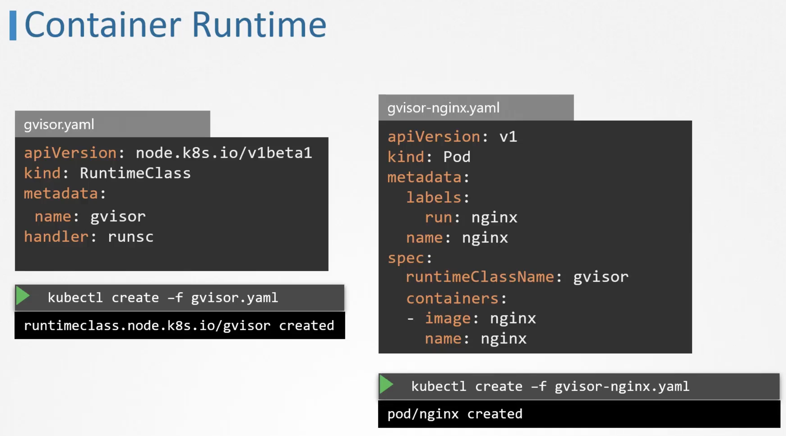
- Static Analysis of Manifests allow you to check and verify the manifests before even executing the kubectl command. one tool of static analysis is `kubesec`
- `kubesec scan pod.yaml`
- `curl -sSX --data-binary @"pod.yaml" https://v2.kubesec.io/scan"`
- `kubesec http 8080`: run kubesec locally
- `Trivy`: Scan images for known vulnerabilities
- `trivy image nginx:1.18.0`
