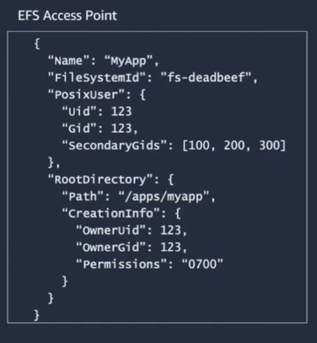
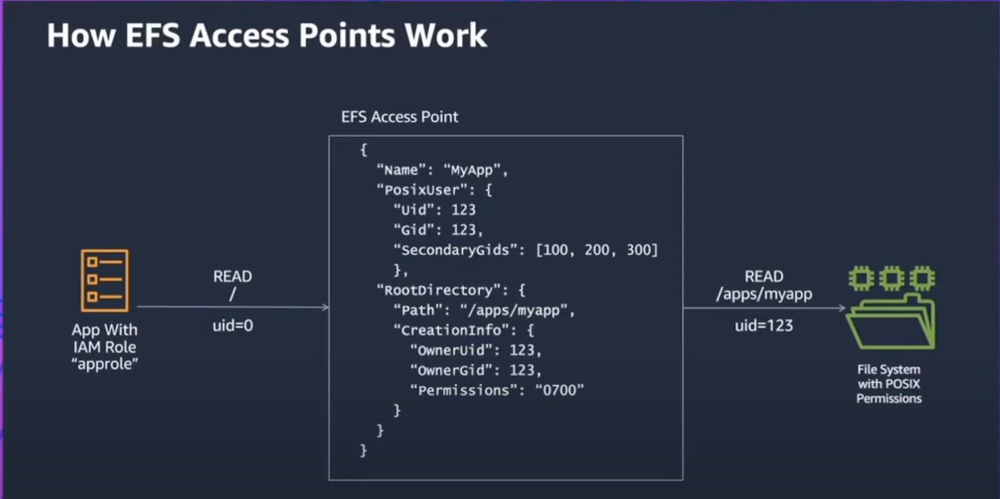
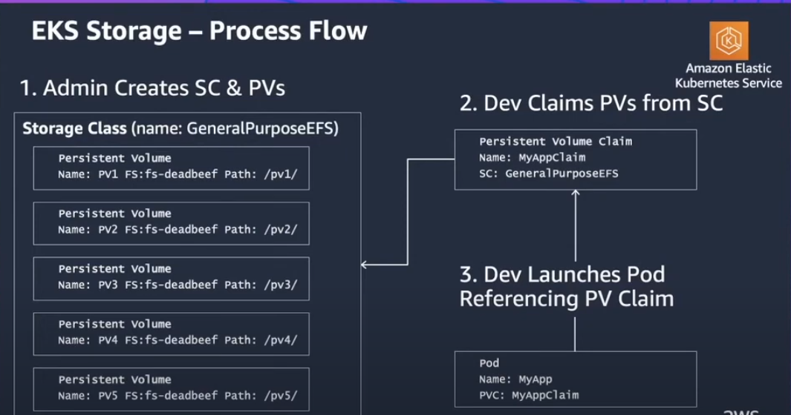
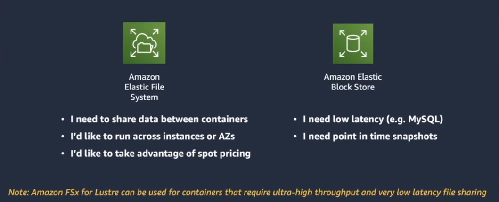
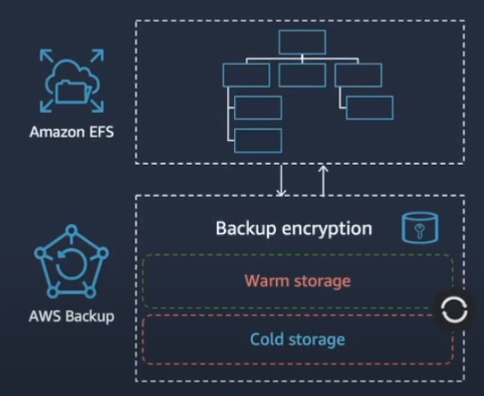
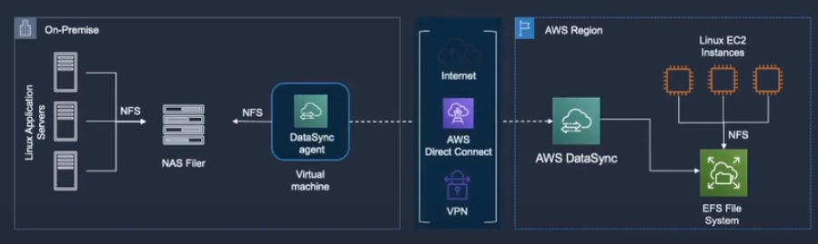

# Persistent File Storage for EKS with Amazon EFS

- Long-running stateful applications needs external storage to make sure that data is not lost if containers are down because containers are ephemeral by nature.
- Many applications needs Shared Data Sets
- **Amazon Elastic File System EFS** is a Serverless File Storage:
  - `Cloud Native`: it was built in the cloud. Fully managed pay as you go service and it is integrated with other services like EKS.
  - `Highly reliable`: It is a regional service which means whenever we write data it is persisted into 3 AZs in that region.
  - `Cost optimized`: There are 2 models which are EFS standard and EFS infrequent access (92% lower access)
- By default, POSIX identity comes from the container image, not the pod runtime.
- **Application-specific Access with EFS Access Points**
  
  - When we use an access point, all applications connecting through the access point will inherit this uid and Gid and not the one that the container was built with.
  - Enforces File system identity: root containers can't escalate access arbitrary users aren't locked out
  - Creates App-specific Directory & permissions: No EC2 instance required! Apps only see data they need.
    

# EFS & EKS



1. Create Storage Class:

```yaml
kind: StorageClass
apiVersion: storage.k8s.io/v1
metadata:
  name: efs-sc
provisioner: efs.csi.aws.com
```

2. create Persistent Volume:

```yaml
apiVersion: v1
kind: PersistentVolume
metadata:
  name: efs-pv
spec:
  capacity:
  storage: 5Gi
  volumeMode: Filesystem
  accessModes:
    - ReadWriteMany
  storageClassName: efs-sc
  csi:
    driver: efs.csi.aws.com
    volumeHandle: fs-deadbeef::fsap-deadbeefdead
```

- There is no point in finding a pv with a specific capacity as the capacity can grow as big as needed. so the field is ignored.
- volumeHandle: `{fsid}:{subpath}:{apid}`

# EFS vs EBS



- Make sure your optimizing your cost by enabling lifecycle management on your filesystem

# Backup for Amazon EFS:

- EFS file systems can be backed up and restored using AWS Backup
- AWS backup provides automated backup scheduling and retention per used defined policy
- AWS Backup offers two classes of service backup storage with the ability to lifecycle to cold storage.
- Restore individual files and directories
  

# AWS DataSync:

- AWS DataSync: Online transfer service that simplifies, automates and accelerates moving data between on-premises storage and AWS.
  

# AWS EFS CSI driver:

- Dynamic persistent volume provisionning with Fargate nodes, but you can use static provisioning.
- There is a resource quotas for Amazon EFS. For example, there's a quota of 1000 access points that can be created for each Amazon EFS file system.
- Currently Dynamic provisionning creates an access point for each PV. This mean an amazon EFS file system has to be created manually on AWS first and should be provided as input to the storage class parameter
- EFS CSI driver allows multiple pods to write to a volume at the same time with the `ReadWriteMany` mode.

1. Create an Amazon EFS file system for your Amazon EKS cluster:
   `aws efs create-file-system --creation-token eks-efs`
2. create a mount target for Amazon EFS:
   `aws efs create-mount-target --file-system-id FileSystemId --subnet-id SubnetID --security-group sg-xxx`

Be sure to run the command for all AZs with the subnetID in the availability zone where your worker nodes are running.
We can create mount targets for all the AZ where worker nodes are launched. Then, all EC2 instances in the AZ with the mount target can use the file system.

# AWS EBS:

- AWS EBS is the default storage for creating persistent volume. But biggest challenge with using EBS as persistent volume in kubernetes cluster is, it can work in `ReadWriteOnce` access mode only which means it can be mounted in read-write mode when all pods are running on single node but if pods are running on multiple nodes, they will not be able to access the data.

# Setup EFS for EKS:

https://blog.cloudtechner.com/setting-up-efs-as-persistent-volume-for-aws-eks-d16f5f46951e
