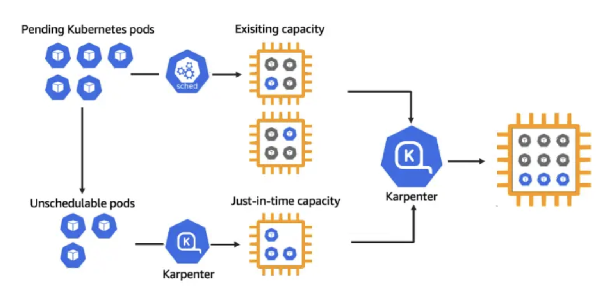

- Karpenter is designed to run on a node in k8s.
- To configure karpenter, you need to create `NodePools`: They set constraints on the nodes that can be created by karpenter and the pods that can run on them.
- Karpenter will create and delete Node claims in response to the demands of pods in the cluster. It does this by evaluating the requirements of pending pods, finding a compatible `NodePool` and `NodeClass` pair and creating a `NodeClaim` which meets both sets of requirements.
- Whenever Karpenter creates a NodeClaim, it asks the cloud provider to create the instance, register and link the created node with the NodeClaim and wait for the node and its resources to be ready.
  https://karpenter.sh/docs/concepts/nodeclaims/
  
- Karpenter will can be installed with helm and it will be running as a deployment in the karpenter namespaces.
- Karpenter automatically discovers nodes that are eligible for disruption and spins up replacements when needed:
  - **Expiration**: Karpenter automatically expires instances after 720h by default, forcing a recycle allowing nodes to be kept up to date.
  - **Drift**: Changes in `NodePool` or `EC2NodeClass`
  - **Consolidation**: Karpenter will optimize the cluster's compute on an going bases. if workloads are running on under utilized compute instances, it will consildate them to fewer instances.

```YAML
apiVersion: karpenter.sh/v1beta1
kind: NodePool
metadata:
  name: default
spec:
  template:
    metadata:
    # We are asking the NodePool to start all new nodes with a kubernetes label type: karpenter
      labels:
        type: karpenter
    spec:
      requirements:
      # We are limiting the provisionning of instances to on-demand with specific types
        - key: "karpenter.sh/capacity-type"
          operator: In
          values: ["on-demand"]
        - key: "node.kubernetes.io/instance-type"
          operator: In
          values: ["c5.large", "m5.large", "r5.large", "m5.xlarge"]
      nodeClassRef:
        name: default
  # A NodePool can define a limit on the amount of CPU and memory managed by it. if limit reached, karpenter will no longer provision additional capacity associated with that nodepool.
  limits:
    cpu: "1000"
    memory: 1000Gi
  disruption:
    consolidationPolicy: WhenUnderutilized
    expireAfter: 720h # 30 * 24h = 720h

```

- we will also need an `EC2NodeClass` which provides the specific configuration that applies to AWS.

```YAML
apiVersion: karpenter.k8s.aws/v1beta1
kind: EC2NodeClass
metadata:
  name: default
spec:
  amiFamily: AL2023 # Amazon Linux 2023
  role: "${KARPENTER_ROLE}"
  #This is used to look up the subnets where karpenter should launch the EC2.
  subnetSelectorTerms:
    - tags:
        karpenter.sh/discovery: $EKS_CLUSTER_NAME
  #This is used to look up the security groups that will be attached to the EC2.
  securityGroupSelectorTerms:
    - tags:
        karpenter.sh/discovery: $EKS_CLUSTER_NAME
  #We define a set of tags that will be applied to EC2 instances created which enables accounting and governance.
  tags:
    app.kubernetes.io/created-by: eks-workshop

```

## Karpenter Prerequisites:

1. IAM Role for Karpenter to call `AWS APIs`
2. IAM Role and instance profile for the ec2 instances that karpenter creates:

3. EKS Cluster access entry for the node IAM role so the nodes can join the EKS Cluster
4. SQS queue for karpenter to receive Spot interruption, instance re-balancer and other events.

## Karpenter provisioners with terraform

- In terraform we need three providers to be configured: `aws`, `helm` and `kubectl`.
- We need to create **`IRSA`**: Configure OIDC-backed identity provider to allow karpenter ServiceAccount to assume the role. This is done through a module named `iam-assumable-role-with-oidc`
- Attach Policy that has required permissions to the IAM role created above.
- Modify the EKS node role that was created by EKS module as it needs extra permissions to be added

## External Links

- [AWS Karpenter Workshop](https://catalog.workshops.aws/karpenter/en-US/install-karpenter)
- [Medium Link](https://itnext.io/terraform-building-eks-part-3-karpenter-installation-124b4ced729f)
- [Provisionning AWS Karpenter with terraform](https://medium.com/@ahil.matheww/provisioning-aws-karpenter-provisioners-with-terraform-1cade400c104)
  https://rtfm.co.ua/en/terraform-building-eks-part-3-karpenter-installation/
