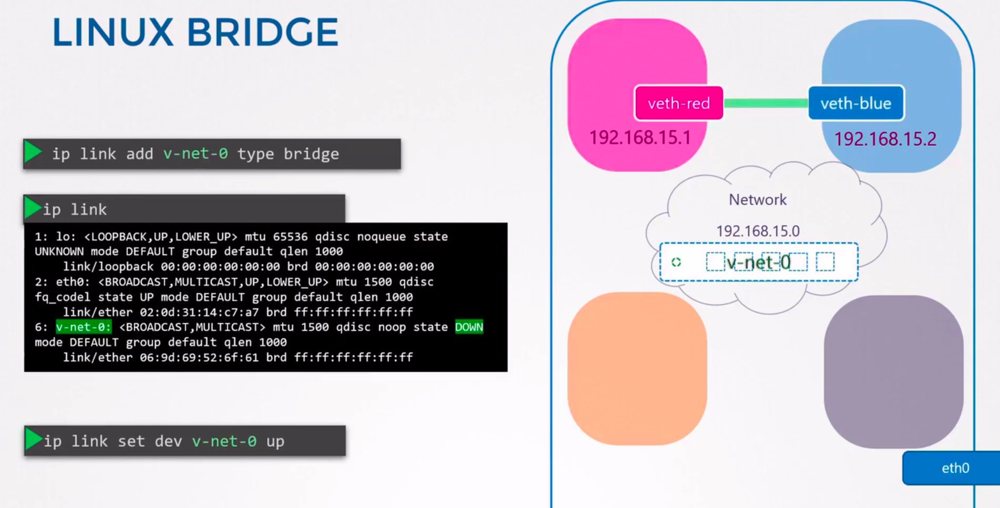

# Deployment manifest:
- A deployment rollout is triggered if and only if the deployment's pod template is changed, for example if the labels or container images of the template are updated. Updates such as scaling the deployment, do not trigger a rollout. When we update the deployment, The deployment update the pods by creating a new replicaset and scaling it up and scaling the old replicaset. 
    - ## Liveness and Readiness Probes: - 
        -`periodSeconds`: specifies that the kubelet should perform a liveness or readiness proble each x seconds. 
        -`initialDelaySeconds`: tells the kubelet that it should wait x seconds before performing the first probe
        - `failureTreshold`: after a probe fails failureTreshold times in a row, kubernetes considers that the overall check has failed.
        - for a failed readiness probe the kubelet continues running the container that failed the check and also continues to run more probes because the check failed(it sets ready condition of the pod to false). 
        - for a failed liveness probe, if at least failuretreshold probes have failed, kubernetes treats the container as unhealthy and triggers a restart for that container into account.
        - `successTreshold`: Minimum consecutive successes for the probe to be considered successful after having failed
        - `timeoutSeconds`: Number of seconds after which the probe timesout 
    - ## Resource limits and requests: 
        - If no Ressource Request is specified: the pod will request 0.5 cpu and 256 Mi of memory. 
        - If no resource limit is specified: the pod will be limited to 1 cpu and 512 Mi of memory. 
        - If a pod tries to consume more cpu than its limit kubernetes throttles the pod but for the memory the pod will be terminated 
        - If only container limit is specified but not its request: For cpu the cpu request will be assigned the cpu limit. 
        - If you specify container's request but not its limit: the container will be assigned the default container limit 
        - If you want to change the default assigned values we need to create a new `LimitRange` resource. 
# Ingress: 
- Ingress may be configured to give service externally reachable URL5, load balance traffic, terminate ssl/tls, and offer name-based virtual hosting. 
- `kubernetes.io/ingress.class` : annotation can be used to specify which ingress controller should serve a particular ingress object. This annotation is deprecated and you should `spec.ingressClassName`.
- `nginx.ingress.kubernetes.io/ssl-passthrough`: when enabled request will not be decrypted at the load balancer but passed along to a server for decryption. SSL passthough is used when web application security is a top concern. 
- `nginx.ingress.kubernetes.io/backend-protocol`: le protocol de communication entre le ingress controller et le backend. 
- `kubernetes.io/ingress.allow-http`: if you want to disable HTTP traffic between the client and the load balancer you should mark it false. 
<br>

# Pull From Private Registry:

- A kubernetes cluster uses the secret of `kubernetes.io/dockerconfigjson` type to authenticate with a container registry to pull a private image.
- If you already ran `docker login`, you can copy that credentials into kubernetes:
```conf
kubectl create secret generic regcred \
    --from-file=.dockerconfigjson=<path/to/.docker/config.json> \
    --type=kubernetes.io/dockerconfigjson
```
- Base64 encode the docker configuration file and then pass that string, unbroken as the value field data[".dockerconfigjson"]

- **Create Secret By providing credentials on the CLI**: Create this secret naming it `regcred`
```conf
kubectl create secret docker-registry regcred --docker-server=<your-registry-server> --docker-username=<your-name> --docker-password=<your-pword> --docker-email=<your-email>
```
- **Create Pod that uses the secret**: 
```conf
apiVersion: v1
kind: Pod
metadata:
  name: private-reg
spec:
  containers:
  - name: private-reg-container
    image: <your-private-image>
  imagePullSecrets:
  - name: regcred
```
# Networking:
- **ip link**: List and modify interfaces on the host.
- **ip addr**: To see the ip addresses assigned to these interfaces.
- **ip addr add 192.168.1.10/24 dev eth0**: set ip addresses on the interfaces.
- **route\ip route**: is used to show the routing table.
- **ip route add 192.268.1.0/24 via 192.168.2.1**: add new entry to the routing table
- **cat /proc/sys/net/ipv4/ip_forward** this command is used to check if ip forwarding is enabled on the host. if set to 1 then it is enabled otherwise it is not.
- **cat /etc/resolv.conf**: contains ip address of DNS server.
- **cat /etc/hosts**: contains all dns entries on local machine. By default, it is this file that is refered to and if no result was found then it is the remote resolver that resolves the DNS.
- **cat /etc/nsswitch.conf**: To override the default behavior that checks /etc/hosts and the /etc/resolv.conf.
- **ip netns add red**: create a new network namespace.
- **ip netns**: list network namespaces.
- To connect two network interfaces we need to create a virtual cable or a pipe.
- **ip link add veth-red type veth peer name verth-blue**: This create the link between veth-red and veth-blue and the next thing is to attach each veth to the appropriate ns.
- **ip link set veth-red netns red**: attach the veth interface to the red network namespace.
- **ip -n red addr add 192.168.15.1 dev veth-red** attach an ip address to the veth-red interface.
- **ip -n red link set veth-red up**:

