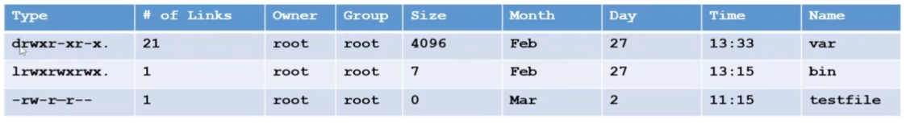
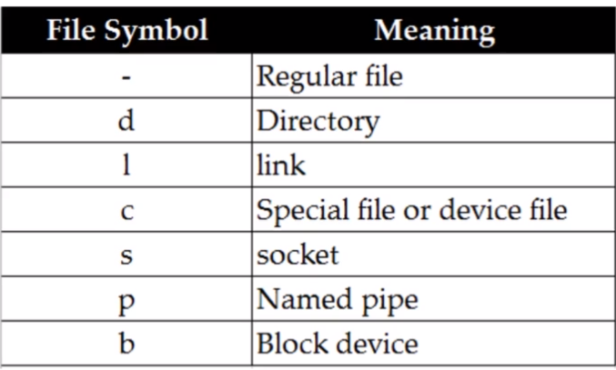

- Linux kernet is not an operating system. It is a small software within Linux operating system that takes commands from users and pass them to system hardware or peripherals. 
# System Access and File System
- File system structre 
    - **/boot**: contains file that is used by the boot loader
    - **/root**: root user home directory. it is not same as **/**
    - **/dev**: system devices (eg. disk, cdrom, speaker, flashdrive, keyboard etc)
    - **/etc**: All configuration files
    - **/usr/bin**: Everyday user commands
    - **/usr/sbin**: system/filesystem commands
    - **/opt**: optional add_on applications (Not part of OS apps)
    - **/proc**: running processes (only exist in Memory)
    - **usr/lib**: C programming library files needed by commands and apps (to check library used by command: `strace -e open pwd`)
    - **/tmp**: Directory for temporary files
    - **/home**: Directory for users
    - **/var**: System logs
    - **/run**: system daemons that start very early to store temporary runtime files like PID files
    - **/mnt**: to mount external filesystem.
    - **/media**: for cdrom mounts

**Ls Output Explained:**

**File Types**:

-