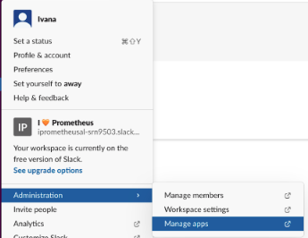
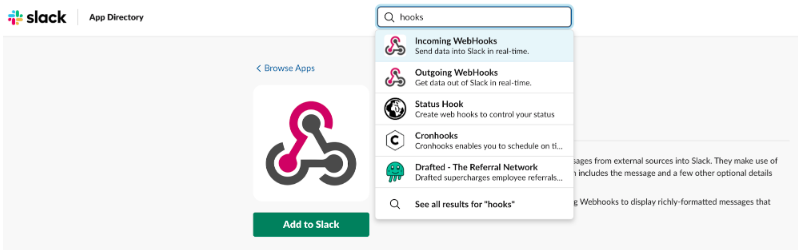

# Alerting System using Slack
 - **Generate SLACK API URL**: Go to Slack -> Administration -> Manage apps.

 - **Add webHooks**: In the Manage apps directory, search for Incoming WebHooks and add it to your Slack workspace.
 
 - **Create new Notification channel**: If we do not have an existing channel, create a new one to which alertmanager will send notifications. After you confirm and add Incoming WebHooks integration, webhook URL (which is your Slack API URL) is displayed. (Copy it and save it for later use)

