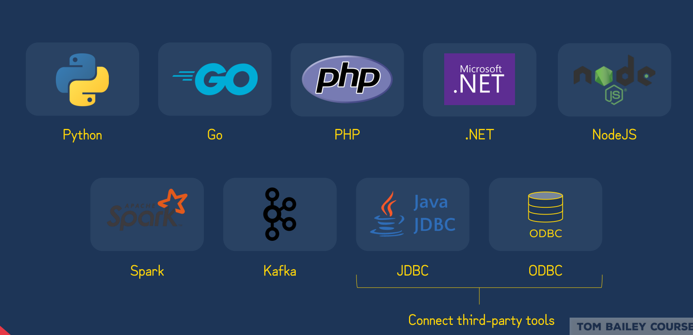

SAS Product
pay as you use payment model
Automatic optimisation
Shared disk or shared nothing: 
    * Shared disk: keeping data in one single disk
    - Shared nothing: Hadoop and Spark
    - SnowFlake: Multi cluster shared data architecture
1. Storage Layer: 

* When data files are loaded or rows inserted into a table, snowflake reorganizes the data into its proprietary compressed, columnar table file format.
* The data is loaded or inserted is also partitioned into what snowflake call micro partitions
* Storage is billed by how much is stored based on a flat rate per TB calculated monthly.
* Data is not directly accessible in the underlying blob storage, only via SQL commands.

2. Query Processing Layer:

* Consists of Virtual warehouses that execute the processing tasks required to return results for most SQL Statements
* A virtual Warehouse is a named abstraction for a cluster of a cloud-based compute instances that snowflake manage.
* Underlying nodes of a virtual warehouse cooperate in a similar way to a shared-nothing compute clusters making use of local caching.
* Virtual warehouses come in multiple "t-shirt" sizes indicating their relative compute power.
* All running virtual warehouses have consistent access to the same data in the storage layer.

3. Services Layer:
* Shared between accounts
* Is a collection of f


A. Snowflake Editions:
    1. Standard:
    2. Enterprise
    3. Business Critical
    4. Virtual Private Snowflake
- **Search Optimization**: Not available for `Standard`
- **Materialized Views**: Not Available for `Standard`
- **Column and row access policies**: Not available for `Standard`
- **Multi Cluster Virtual Warehouses**: Not Available for `Standard`
- **Database Failover and failback**: Not available for `Standard`
- **Tri-Secret secure**: Not available for `Standard` and for `Enterprise`
- **Private connectivity**: Not Available for `Standard` and for `Enterprise`
- **Support For compliance regulation**: Not available for `standard` and for `Enterprise`
- **Dedicated Metastore and pool of compute resources**: Not available for `Standard` `Enterprise` and `Business Critical`
<br>

# B. Functions & Procedures:
- UDFs can be written in Java, Javascript, SQL and Python.
- Java UDFs cannot be designated as secure.
- Javascript UDFs can be recursive.
- UDF can only execute with the owner right
- External Functions are Slower, Less secure, Egress charges, Scalar only and not sharable.
- Stored Procedures can be written in Javascript, SQL, PYTHON, JAVA and Scala.
- Stored Procedures can execute with the owner's rights or the callers rights.
- Stored procedures can mix javascript and SQL in their definition using Snowflake's Javascript API.
- Stored procedures can call itself recursivly.
<br>

# C.Sequences:

- Sequences cannot guarantee their values will be gap free.
<br>

# D. Tasks & Streams:
- A task is an object used to schedule the execution of a SQL command or a stored procedure.
- Requires `ACCOUNTADMIN` role or `CREATE TASK` privilege.
- After a task is created we need to execute `ALTER TASK TASK_NAME RESUME` to start the task.
- we can create a Tree of tasks by adding the `AFTER TASK1` in the create statement.

- A stream is an object created to view & track DML changes to a source table `Inserts`, `updates` & `deletes`.
- Stream adds three extra columns to the table `METADATA$ACTION`, `METADATA$ISUPDATE` and `METADATA$ROW_ID`.


<br>

# E. Billing Overview:
- There is two payment models: On-demand (pay for usage as you go) and capacity (pay for usage upfront).
- We will get billed for: `Virtual warehouse services`, `Cloud services`, `Serverless services`, `Storage` and `Data transfer`.
- Pay in **Credits**: `Virtual warehouse`, `Cloud services` and `Serverless services`
- Pay in **Dollars**: `Storage` and `Data transfer`.
- **Virtual Warehouse services**: Credit calculated per second based on size of VW with a minimulm of 60 seconds.
- **Cloud Services**: Credit calculated at a rate of 4.4 Credits per compute hour. Only Cloud services exceeding 10% of the daily usage of the compute resources are billed (This is called `Cloud Services Adjustment`) 
- **Serverless Services**: Serverless features are composed of compute services and cloud services but Cloud services Adjustment does not apply to Cloud services usage.
- **Database Storage**: Data storage is calculated monthly based on the average number of on-disk bytes per day in `Database tables` & `internal stages`.
- **Data Transfer**: Data transfer charges apply when moving data from one region to another or from one cloud platform to another, Unloading Data using `COPY INTO` command, External functions transferring data out and into snowflake.

- SnowCD is a connectivity and Diagnosis tool.

<br>

# F. Connectors and Drivers

- Snowflake Partner tools:
    - **BI**: Tableau, PowerBI, Qlik, Thoughtspot
    - **Data Integration**: dbt Labs, Informatica, Pentaho, Fivetran
    - **Securiy & Governane**: Collibra, DATADOC, VAULT, Data.world
    - **Machine Learning & Data Science**: DataRobot, Dataiku, Amazon SageMaker, Zepl
    - **SQL Development & Management**: sqlDBM, SEEKWELL, ackolade, Agine data engine
- Snowflake partner connect is a feature to expedite connectivity with partnered tools.
<br>

# J. Snowflake Scripting:
- Snowflake scripting is an extension to Snowflake SQL that adds support for procedural logic.


- snowpark api is for Java, scala and Python.

<br>

# H.Access Control overview:
- `RBAC`: is an access control framework in which access privileges are assigned to roles and in turn assigned to users.
- Snowflake combines RBAC with `Discretionnary Access Control DAC` in which each object has an owner, who can in turn grant access to that object. 

- **Role**: A role is an entity to which privileges on securable objects can be granted or revoked.
- **Roles**: A user can have multiple roles and switch between them within a snowflake session.

- Privileges are managed using the `GRANT` and `REVOKE` commands.
- Future grants allow privileges to be defined for objects not yet created.

- MFA in snowflake is powered by a service called `DUO Security`.
- MFA is enabled on a per-user basis & only via the UI.
- **MINS_TO_BYPASS_MFA**: specifies the number of minutes to temporarily disable MFA for the user so that they can log in.
```conf
ALTER USER user1 SET
MINS_TO_BYPASS_MFA=10
```
- **DISABLE_MFA**
- **ALLOWS_CLIENT_MFA_CACHING**: MFA token caching reduces the number of prompts that must be acknowledged while connecting and authenticating to snowflake.
- **Network Policies**: provide the user with the ability to allow or deny access to their snowflake account based on a list of IP @. Netpol can be applied to the account level or to individual users.

- Blocked IP ranges are applied first. Netpol currently supports only IPV4 addresses.
- If a user is associated to both an account-level and user-level netpol, the user level netpol takes precedence.
- Only one netpol can be associated with an account or user at any one time by `SECURITYADMIN` or `ACCOUNTADMIN`.
- Snowflake follows a Hierarchical Key Model. The root key is based on AWS CloudHSM.
- **Key Rotation**: is the practice of transparently replacing existing account and table encryption keys every 30 days with a new key.
- **Re-Keying**: Once a retired key exceeds 1 year, Snowflake automatically creates a new encryption key and re-encrypts all data previously protected by the retired key using the new key.

<br>

## a.Column Level Security:
- **Dynamic Data Masking**: sensitive daat in plain text is loaded into snowflake and it is dynamically masked at the time of query for unauthorized users.

- **External Tokenization**: Tokenized data is loaded into snowflake, which is detokenized at query run-time for authorized users via masking policies that call an external tokenization service using external functions.


## b. Row level Security
- **Row Access policies**: enable a security team to restrict which rows are returned in a query.
- Row access policies are evaluated before data masking policies.

## c. Secure views:
- Secure views are a type of view designed to limit access to the underlying tables or internal structural details of a view.
- The definition of a secure view is only available to the object owner.
- Secure views bypass query optimization which may inadvertently expose data in the underlying table.

# I. Account Usage and Information Schema:


- Account usage includes dropped objects vs Information schema NO.
- Latency of data From 45 minutes to 3 hours vs Information schema none.
- Retention of historical data 1 year vs 7 days to 6 months.

# J. Virtual warehouse:
- Virtual warehouses execute DQL operations (Select), DML operations (update) and Data loading operations (COPY INTO).
- Virtual warehouses can be created via the snowflake UI or through SQL commands.
- Virtual warehouses can created in 10 t-shirt sizes from x-small to 6X-large (x-small, small, medium, large , X-large .. 6X-large)
- Data loading does not typically required large virtual warehouse and sizing up does not guarantee increased data loading performance.

- Virtual warehouse state is either: `STARTED`, `SUSPENDED` or `RESIZING`. By default when a warehouse is created it is in the started state.
- **AUTO_SUSPEND=300**: Specifies the number of seconds of inactivity after which a warehouse is automatically suspended.
- **AUTO_RESUME=TRUE**: Specifies whether to automatically resume a warehouse when a SQL statemnt is submitted to it.
- **INITIALLY_SUSPEND=TRUE**: Specifies whether the warehouse created initially in the suspended state.
- Resizing a running warehouse does not impact running queries. This additional compute resources are used for queued and new queries.
- **Standard Scaling Policy**: When a query is queued a new warehouse will b eadded to the group immediately. Every minute a background process will check if the load on the least busy warehouse can be redistributed to another warehouse. If this condition is met after 2 consecutive minutes a warehouse will be marked for shutdown.
- **Economy Scaling Policy**: When a query is queued the system will estimate if there's enough query load to keep a new warehouse busy for 6 minutes. Every minute a background process will check if the load on the least busy warehouse can redistributed to another warehouse. If this condition is met after 6 consecutive minutes a warehouse will be marked for shutdown.
- **MAX_CONCURRENCY_LEVEL=6**: Specifies the number of conurrent SQL statements that can be executed against a warehouse before either it is queued or additional compute power is provided.
- **STATEMENT_QUEUED_TIMEOUT_IN_SECONDS=60**: Specifies the time, in seconds, a SQL statement can be queued on a warehouse before it is aborted.
- **STATEMENT_TIMEOUT_IN_SECONDS=600**: it specifies the time, in seconds after which any running SQL statement on a warehouse is aborted.
<br>

# K. Resource Monitors:
- Resource monitors are objects allowing users to set credit limits on user managed warehouses.
- Ressource monitors can be set either on the account or individual warehouse level. Limits can be set for a specified interval or data range.
- When limits are reached an action can be triggered such as notify user or suspend warehouse.
- Ressource monitor can only be created by account administrators.

# L. Performance and Tuning Overview:


# M. Caching:
- **Metadata Cache**: Snowflake has a high availability metadata store which maintains metadata object informations and statistics. Some queries can be completed purely using metadata, not requiring a running virtual warehouse.

- **Result Cache**: New query exactly matches previous query. The underlying table data has not changed. The same role is used as the previous query.
- Result cache can be disabled using the session parameter `USE_CACHED_RESULT`.
- **Warehouse Cache**: Virtual warehouses have local SSD storage which maintains raw table data used for processing a query. The larger the virtual warehouse the greater the local cache. It can be used partially, retrieving the rest of the data required for a query from remote storage.
- `Materialized Views`: is pre-computed & persistent data set derived from a SELECT query.
- Snowflake maintains the following clustering metadata for micro-partitions in a table: `Total number of micro partitions`, `Number of overlapping micro-partitions`, `Depth of Overlapping Micro-partitions`
- **SYSTEM$CLUSTERING_INFORMATION**
- Snowflake supports specifying one or more table columns/expressions as a clustering key for a table.
- Clustering aims to co-locate data of the clustering key in the same micro partitions.
- Clustering should be reserved for large tables in the multi-terabyte range.
- Clusering improves performance of queries like: `WHERE`, `JOIN`, `ORDER BY` and `GROUP BY`.
- Snowflake recommend a maximum of 3 or 4 columns or expressions per key.
- As DML operations are performed on a clustered table, the data in the table might become less clustered.
- Initial clustering and subsequent reclustering operations consume `compute & storage credits`.
- Clustering is recommended for large tables which do not frequently change and are frequently queried.

# Search Optimization Service:
- Search optimization service is a table level propery aimed at improving the performance of selective point lookup queries.
- The search optimization service is an enterprise edition feature.
- The keyword `OVERWRITE` will truncate a table before new values are inserted into it.
- `Stages` are temporary storage locations for data files used in the data loading and unloading process.

- `External stages`: reference data files stored in a location outside snowflake.

- The `PUT` command uploads data files from a local directory on a client machine to any of the three internal stages. Duplicate files uploaded to a stage via PUT are ignored. 
- Uploaded files are automatically encrypted with a `128-bit key` with optiona support for `256-bit key`.
- **COPY INTO**: statement copies the content of an internal or external stage or external location directly into a table.
- The following formats can be uploaded into snowflake: `Delimited files (CSV, TSC, etc)`, `JSON`, `AVRO`,`ORC`,`PARQUET`,`XML`.
- The copy into command requires a user created virtual warehouse to execute and the Load history is stored in the metadata of the target table for 64 days, which ensures files are not loaded twice.
- **LOAD Transformatons** allows users to perform: `Column reodering`, `Column omission`, `casting` and `Truncate test string that exceed target length`.

- **VALIDATION_MODE**: Optional parameter allows you to perform a dry-run of load process to expose errors (RETURN_N_ROWS, RETURN_ERRORS, RETURN_ALL_ERRORS).
- **VALIDATE**: Validate is a table function to view all errors encountred during a previous COPY INTO command.Validate accepts a job id of a previous query or the last load operation executed.

- File format options can be set on a named stage or COPY INTO statement. Explicitly declared file format options can all be rolled up into independent file format snwoflake objects.
- File Formats can be applied to both named stages and COPY INTO statements. if set on both COPY INTO will take precedence.


# Snowpipe and Loading Best practises:

- Snowpipe is designed to load new data typically within a minute after a file notification is sent.
- Snowpipe is serverless feature, using snowflake managed compute resources to load data files.
- Snowpipe load history is stored in the metadata of the pipe for 14 days to prevent reloading the same files into a table.
- When a pipe is paused, event messages received for the pipe enter a limited retention period. The period is 14 days by default.
- Data loading best practices:
    - 100-250 MB compressed
    - Organize data by path
    - pre-sort data
    - once per minute
## File format
- File format option can be set on a named stage or COPY INTO statement.
- If specified on both named stages and COPY INTO statement. COPY INTO will take precedence.
- There are two methods for detecting when a new file has been uploaded to a stage:
    - Automating Snowpipe using cloud messaging (external stages only)
    - Calling Snowpipe rest api (Internal and external stages)
- Snowpipe is designed to load new data typically within a minute after a file notification is sent.
- Snowpipe is serverless feature, using snowflake managed resources to load data files not a user managed virtual warehouse.
- snowpipe load history is stored in the metadata of pipe for `14 days`.
## Data unloading
- Table data can be unloaded to a stage via the `COPY INTO` command.
- The GET command is used to download a staged file to the local file system `GET @MY_STAGE file://folder/files/:`
- By default, results unloaded to a stage using COPY INTO LOCATION command are split into multiple files (CSV, GZIP, UTF-8). All data files unloaded to internal stages are automatically encrypted using 128-bit keys.
- COPY INTO includes a `PARTITION BY` copy option to partition unloaded data into a directory structure.
- GET cannot be executed for external stages.
- `VARIANT` is universal semi-structured data type of snowflake for loading data in semi-structured data fromats.
- Snowflake stores the VARIANT type internally in an efficient compressed columnar binary representation.
- VARIANT data type can hold up to 16MB compressed data per row.
- Variant column can contain SQL nulls and VARIANT nulls which are stored as string containing the word null.
- Semi Structured Data types:
    - ARRAY: `ARRAY_CONSTRUCT(value, value2, value3)`
    - OBJECT: `OBJECT_CONSTRUCT('key','value', 'key2', 'value2')`
    - VARIANT: Universal semi structured data type used to represent arbitrary data structures.

## Loading and Unloading semi-structured data
- `STRIP_OUTER_ARRAY`: Only used for loading. If true, JSON parser will remove outer brackets [].
- `STRIP_NULL_VALUES`: Only used for loading. If true, JSON parser will remove object fields or array elements containing NULL.
- `INFER_SCHEMA`: Automatic SCHEMA detection

## SUPPORTED FUNCTIONS TYPES

- **SCALAR Functions**: are used for returning one value per invocation. These are mostly used for returning one value per row. 
- **AGGREGATE FUNCTIONS**: Aggregate functions operate on values across rows to perform mathematical calculations such as sum average & counting.
- **WINDOW FUNCTIONS**: Subset of aggregate functions, allowing us to aggregate on a subset of rows used as input to a function. `MAX(AMOUNT) OVER (PARITION BY ACCOUNT_ID)`
- **TABLE FUNCTIONS**: return a set of rows for each input row. The returned set can contain zero one, or more rows. Each row can contain one or more columns.
- **SYSTEM FUNCTIONS**: provide a way to execute actions in the system. `select SYSTEM$cancel_query('query_id')` or provide information about the system `SELECT system$pipe_status('my_pipe')`

<br>

## ESTIMATION FUNCTION TYPES
- **Cardinality Estimation**: Estimates the number of distinct values.

- **Similarity Estimation**: Estimates similarity between two or more sets.


- **Frequency Estimation**: Estimate frequency of values in a set.

- **Percentile Estimation**: Estimate percentile of values in a set. Percentile is staistical method to express what percentage of a set of values is below a certain value.

## Table sampling:
- Table sampling is a convenient way to read a random subset of rows from a table. `SYSTEM/BLOCK` or `BERNOULLI/ROW`.
## File functions:
 
- **Scoped file URL**: `build_scoped_file_url(stage_name, path_to_file)`. URL is valid for 24 Hours. The caller must have `USAGE` on External named stage or `READ` on internal named stage. If called in UDF, stored procedure or view does not require any privileges. Only the user that generated the scoped file url can download the file. Ideal for use in custom applications providing unstructured data to other accounts via a SHARE or for downloading and ad hoc analysis of unstructured data via SnowSight.
- **Stage File URL** `build_stage_file_url(stage_name, path_to_file)`. URL never expires. Any role that has privileges on the underlying stage can access the file. Ideal for custom applications that require access to unstructured data files.
- **Presigned URL**: `get_presigned_url(stage_name, path_to_file, expiration_time)`:The caller must have `USAGE` on External named stage or `READ` on internal named stage. Ideal for Business Intelligence applications or reporting tools that need to display the unstructured file contents.
- `GET_STAGE_LOCATION(stage_name)`: retrieves the URL for an external or internal named stage using the stage name as input.
- `GET_RELATIVE_PATH(stage_name, absolute_path)`: extracts the path of a staged file relative to its location in the stage using the stage name and absolute file path in cloud storage as inputs.
## Directory Tables:
```conf
CREATE STAGE INT_STAGE
DIRECTORY =  (ENABLE = TRUE)
```

- Directory tables must be refreshed to reflect the most up to date changes made to stage contents. This include new files being uploaded, removed files and changes to files in the path.
```conf
ALTER STAGE STAGE_NAME REFRESH;
```
## Micro partitions:
- Snowflake partitions along the natural ordering of the input data as it is inserted/loaded.
- Micro partitions are physical files stored in blob storage and range between 50mb-500mb of uncompressed data.
- Micro partitions are immutable, they are write once read many.
- Micro partitions metadata allows Snowflake to optimize a query by first checking the min-max metadata of a column and discarding micro-partitions that are not required from the query plan.
## TIME TRAVEL
- The default data retention time on account,  database, schema and table is 1 day. On the standard edition the minimum value 0 and the maximum retention time is 1 day. For enterprise and higher it's between 0 and 90 days.
- Temporary and Transient tables can have a max retention period of 1 day across all editions

- **Fail-safe**: non configurable period of 7 days in which historical data can be recovered by contacting snowflake support. It could take several hours or days for snowflake to complete recovery.
## cloning:
- Users can clone:
    - DATABASE
    - Schemas
    - TABLES
    - STREAMS
    - STAGES
    - SEQUENCES
    - FILE FORMATS
    - TASKS
    - PIPES (reference external stage only)
- Cloning is a metadata only operation, copying the properties, structure and configuration of it's source.
- **ZERO-COPY Cloning**: Changes made after the point of the cloning then start creating additional micro partitions.
- External tables and internal named stages are never cloned.
- Cloaned table does not contain the load history of the source table.
## Replication:
- Replication enables replicating databases between accounts in the same orgnization.
- The secondary database can be periodically refreshed.
- External tables, stages, pipes, streams and tasks are not currently replicated.
- Only databases and some of their child objects can be replicated, not users, roles, warehouses, resource monitors or shares.

- **Secure Data Sharing**: allows an account to provide read only access to other accounts without transferring data.
- An account can share the following objects: `Secure views`,`Secure materialized views` `Secure UDFS`, `Tables`, `External tables`.
- Only one database can be added by share.
- No hard limits on the number of shares you can create or the number of accounts you can add to your share.
- A data consumer cannot use time travel on shared database objects.
- A data consumer cannot create a clone of a shared database or database objects.
- To create a database from a SHARE the user must have `IMPORT` Privilege granted
- **DATA Provider**, **DATA Consumer** and **READER Account**: The reader account allows a non-snowflake customer to gain access to the providers data. 
- **DATA EXCHANGE**: is a private version of the DATA MARKETPLACE for accounts to provide. A data exchange for snowflake account is set with snowflake support by providing a name and a description.

<br>

## ACCOUNT USAGE & INFORMATION SCHEMA:

- **INFORMATION_SCHEMA**: can be used to find out about storage, compute and objects in a snowflake account.

- Warehouse performance can be evaluated by querying the `Account Usage` `Query History` view.

- **User access history** can be found by querying the `Account usage` `ACCESS_HISTORY` view. This view can be used to query snowflake query history by various dimensions (ime range, session, user, warehouse etc) within the last 365 days.

- **Snowflake History Page**: allows you to view the details of all the queries executed in the last 14 days. You can query `QUERY_HISTORY` view in snowflake's `ACCOUNT USAGE` schema for older queries.

<br>

## DATA LOADING AND UNLOADING:

- `ENFORCE_LENGTH` option for COPY INTO: If `TRUE`, the COPY statement produces an error if a loaded string exceeds the target column length. if `FALSE`, strings are automatically truncated to the target column length.
- `TRUNCATECOLUMNS`: if `TRUE`, strings are automatically truncated to the target column length. If `FALSE`, the COPY statement produces an error if a loaded string exceeds the target column length.
- `OUTER => FALSE`: argument with `FLATTEN` omits the output of the input rows that cannot be expanded, either because they cannot be accessed in the path or because they have zero fields or entries.
- `OUTER => TRUE`: argument with `FLATTEN` generates exactly one row for zero-row expansions (with NULL in the KEY, INDEX and VALUE columns). `RECURSIVE` is used to instruct if only the element referenced by `PATH` is expanded or expansion is performed for all sub-elements recursively MODE specifies whether only objects, arrays or both should be flattened.
- The preferred way to distinguish empty strings from null values while unloading in CSV files is to Encolse strings in quotes by setting the `FIELD_OPTIONALLY_ENCLOSED_BY`option.
- All outputs are encoded using `UTF_8` character set. No other character sets are supported. 
- snowflake supports transforming data while loading it into a table using the COPY command. options include:
    - Column omission
    - Column reordering
    - Casting
    - Truncating text strings that exceed te target column length
- `VALIDATION_MODE`: parameter in the COPY INTO command instructs the command to validate the data files instead of loading them into the specified table. This means the COPY command will test the files for errors, but not actually load them:
    - `RETURN_<n>_ROWS`: validates the specified number of rows and fails at the first error encountred if any, otherwise the validation continues without error.
    - `RETURN_ERRORS`: returns all errors across all specified files, including parsing and conversion errors.
    - `RETURN_ALL_ERRORS`: returns all errors across all specified files, including errors that were partially loaded during a previous load with `ON_ERROR` option set to `CONTINUE`.
    - Validation MODE parameter does not support COPY statements that transform data during load.
- Compression methods supported by Snowflake: `bzip2`, `gzip`, `raw_deflate`, `deflate`, `Zstandard` and `brotli`. Snowflake automatically detect any of these compression methods except for `Brotli` and `Zstandard`.
- Automatic refresh of metadata of the directory table in the cloud storage does incure charges to Snowflake customers. Snowflake charges 0.06 credits per 1000 event notification received.
- XS sized warehouse can load eight files parallely. S sized can load 16 files parallely etc.
- `OBJECT_CONSTRUCT`: function can be used in combination with the COPY command to convert rows in a relational table to a single VARIANT colimn and unload the rows into a file.
- JAVA UDF and tabular JAVA UDF can read and process unstructured data in staged files using either the SnowflakeFile class or the InputStream class in the UDF Code (It is not possible for Python UDF).
- `SYSTEM|BLOCK` sampling is often faster than `BERNOULLI|ROW` sampling. Also, `BERNOULLI|ROW` method is good for Smaller tables and `SYSTEM|BLOCK` method for larger tables.
- Supported Auth methods for REST API are `OAuth` and `Key Pair Authentification`.
- `PURGE = TRUE`: COPY option to delete the file from the snowflake stage when data from staged files are loaded successfully.
- `AUTO_INGEST=TRUE`: enables automatic data loading, snowpipe supports loading from external stages. `AUTO_INGEST=FALSE` disable automatic data loading. You must make calls to the Snowpipe REST API endpoints to load data files.
## Exams:
- **AWS PrivateLink**: is an AWS service for creating private VPC endpoints that allow direct, secure connectivity between your AWS VPCs and the snowflake VPC without traversing the public internet. The connecitivty is for AWS VPCs in the same AWS region.

- The suspended warehouse can be resized.

- After a specified period of time (defined by Idp), a user's session in the idp automatically times out, but this does not affect their snowflake sessions. 

- **Explain plan**: gives us insights on `partition pruning`, `join ordering` and `join types`. The explain plan is a useful tool for determining the efficency of your query. It's a command that compiles your query to figure out all the steps snowflake would have to work through if it were actually to run the query.

- If a policy is assigned to a user who is already logged in the user can't do anything else until signed out and signed back in again. 

- Data spilling can be decreased by:
    - Reducing the amount of data processed( improve parition pruning, projecting only the columns needed)
    - Decreasing the number of parallel queries running in the warehouse.
    - Trying to split the processing into several steps 
    - Using larger warehouse.

- For creating a network policy the parameters that are required are `Policy Name` and `Allowed IP addresses`.

- **Security Admin**: is granted the `MANAGE GRANTS` security privilege to be able to modify any grant inculding revoking it. It can manage any object grant globally, as well as create, monitor and manage users and roles.

- **What is the best way to analyze the optimum warehouse size?**: Execute relatively homogeneous queries (size, complexity, data sets, etc) on the same warehouse; executing queries of widely varying size and/or complexity on the same warehouse makes it more difficult to analyze warehouse load, which can make it more difficult to select the best size to match.

- **Major Benefits of clustering keys**: Help improve query performance and help optimize table maintenance.

- **Temporary tables, External Tables, Stages, Temporary Stages, Streams and Tasks do not get replicated**

- Federated Authentification is supported by all Snowflake editions.

- **SHOW PARAMETER** is the command used to determine whether a network policy is set on the account or for a specific user.
```conf
SHOW PARAMETERS LIKE 'network_policy' IN ACCOUNT;
SHOW PARAMETERS LIKE 'network_policy' IN USER username;
```

- A user's default role is the role a user gets set to each time the user logs in to Snowflake.

- Not all predicate expressions can be used to prune. Snowflake does not prune micro-partitions based on a predicate with a subquery, even if the subquery results in a constant.

- ACCOUNT ADMIN role (or role granted the CREATE ACCOUNT global privilege) only can create the `Reader Account`.

- A DBA_ROLE created a database. Later the DBA_ROLE was dropped. Who will own the database now, which was created by the DBA_ROLE? -> The role that dropped the DBA_ROLE will own the database.

- **Okta and Microsoft ADFS** provide native snowflake suppot for federated authentification and SSO.

- A row access policy uses `Conditional expression functions` and `context functions` to determine which rows should be visible in a given context. Context Functions such as `CURRENT_USER()`, `CURRENT_ROLE()` `CURRENT_ACCOUNT().`

- Snowflake does not begin executing SQL statements submitted to a warehouse until all of the compute resources for the warehouse are successfully provisioned, unless any of the resources fail to provision: If any of the compute resources for the warehouse fail to provision during start-up, Snowflake attempts to repair the failed resources. During the repair process, the warehouse starts processing SQL statements once 50% or more of the requested compute resources are successfully provisioned.
- If cache does fill up, it's flushed out in **`Least recetly used fashion LRU`**


**Questions**:
- Explain Plan Snowflake
- All files stored in internal stages for data loading and unloading are encrypted using AES-256 strong encryption
- What will happen if a policy is assigned to a user who is already signed in?
- Which role can create the account reader account?
- a DBA_ROLE created a database. Later the DBA_ROLE was dropped. Who will own the database now, which was created by the DBA_ROLE?
- You can create an account level network policy using SQL, Snowsight and Classic UI?
- Difference between security admin and user admin?
- Which IdP  vendors provide native snowflake support for federated auth and sso? okta, microsoft adfs?
- benefits of defining clustering keys?
- Query history page 31 days of history?
- Which objects are not replicated?
- Warehouse performance can be evaluated by querying the?
- When the virtual warehouse data cache gets filled up, in which fashion does the data get flushed out from the data cache? LRU?
- Presigned url ideal for?
- Default Character delimiter
- COPY option that deletes a file from the snowflake stage when data is loaded successfully.
- Both external and internal stages support unstructured Data.
- When you Create Or Replace pipe what happens to the load history?
