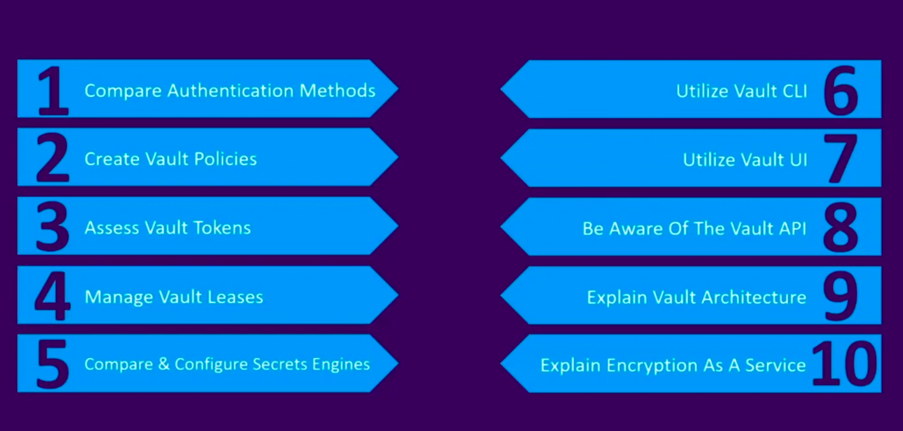

- Creation du namespace
- Activer KV secret engine
- Creation d'un secret

## Retrieve secrets in CD pipeline

- Configurer le AppRole authentication (pour autoriser jenkins to authenticate to Vault with Vault defined roles)
- Creer une policy pour le approle
- Creeer les credentials dans Jenkins
- on a utiliser le vault agent pour generer le template

# Vault Associate Objectives

