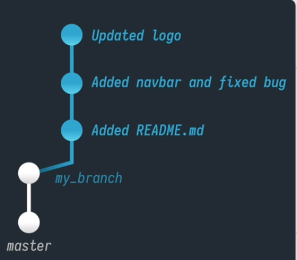

# Rewrite Git Commit:
- If we want to change the commit message of the latest commit we can run `git commit --amend -m "New Commit Message"`
- To change a commit message for an older commit I have to use `git rebase -i HEAD~commit_number`: we change the `pick` action be `reword`. This will tell git to stop when it reaches that operation and give me the ability to change the commit message. This action will create a new commit (change the commit id)
- If I have unstaged files that i want to add to my latest commit I can use `git add file_name` and then `git commit --amend --no-edit` which will add this files to the latest commit and we --no-edit to keep using the same commit message. One thing to keep in mind is that this creates a new commit.
# Git Split Commit:

In this example we want to split the commit added navbar and fixed bug into two different commits
- `git rebase -i HEAD~3`: 
    
- We need to change the `pick` operation to `edit` which will tell git to pause in that commit when it is rebasing.
- `git status`: will show that an interactive rebase is in progress.
- `git reset HEAD^`: unstage the fils corresponding to the commit in which we are paused.
- `git add nav.css nav.html` and then `git commit -m "navbar"`
- `git add bugfix.html` and then `git commit -m "bugfix"`
- `git rebase --continue`

# Delete Git Commit:
- This commands should only be used to delete commits that are not pushed to a shared repository.
- `git log --oneline`: see all commits for current branch.
- `git reset --hard HEAD~1`: Delete most recent commit. Everything in that working directory will be whiped.
- `git reset --soft HEAD~1`: Undo most recent commit. This will undo most recent commit and move the changes into the staging area.
- `git rebase -i HEAD~2`: This tells git that we intend to manipulate the last 2 commits.

The commands on top are the commands that will run on each of the commits specified here at the top in the order that are specified. Each command contains at first the command that will be runned which is `pick` and then the commit that the command will run on. To remove the changes of one commit we need to change the command `pick` to **`drop`**.
- If we face a conflict during this manipulation we sould use `git rebase --abort` and use `git revert` instead.

# Git Squash:
- Squash allows us to combine commits. Squash is not a command it is something available under git interactive rebasing system.

- If we want to squash all these related commits into one large commit then:
    - `git checkout bug_fix`
    - `git rebase -i HEAD~3`: Once the file is opened then we need to change the `pick` command of last two commits into `squash` which will merge these last 2 commits into the first commit.

# Merge & Rebase:
- `git merge`: Will take all changes from both those 2 commits and stuff them into one commit, Then put that merge commit on master.

- `git rebase`: What git rebase does is that it takes all the commits from the feature branch and moves them on top of the master commits. When executing this command git will rewrite history on the master branch. The new commits will have the `same Date and Author` but the `commit id` will be different.

- If I am on my local master, working on a different branch named `feature-1` and other developers already pushed to remote master which makes my remote master out of sync. I can checkout to master, git pull latest commits and then checkout to `feature-1` branch and execute `git rebase master`. This will move `feature-1` commits on top of the master latest commits.
- `git rebase feature-1`: after checkouting to master, this will move feature-1 commits on top of master commits.
- With our feature-1 branch up to date with our remote HEAD, we have some easier merging options a head of us:
    - `git merge feature_branch`: will run a fast-forward merge. Typically move the head pointer from the tip of the mainline branch to the tip of the feature branch. This will merge the feature_branch commits without creating a new merge commit. This is possible only if rebasing feature_branch to the latest remote commit was already done.
    
    - `git merge feature_branch --no-ff`: This will create a new merge commit and keep the feature_branch commits.
    

# Git Cherry Pick

- Cherry pick means getting commits from one branch and applying in to another. The difference of cherry pick against merge and rebase is that it allows you to apply only the changes that you want to apply.
- Steps to do Git cherry pick:
    - `git log branch_name --oneline`: get the git unique identifying hash of the commit we want to add.
    -  `git cherry-pick 4314d45`: What git is doing with this command is applying the changes from that commit to the main branch and creating a new commit.
    - `git cherry-pick 4876514 4314d45`: This will apply the changes to the current branch in the order specified.

# Git Cherry Pick Merge Conflicts

- Resolve conflict steps:
    - `git status`: will show the files that are causing the merge conflicts.
    - `git cherry-pick --abort`: This cancels cherry pick and sets everything back to normal.
    - open the file causing the conflict and do the merge operation manually
    - once conflict is resolved we run `git cherry-pick --continue`
- Resolve Conflict when the changes are not commited yet:
    - we can do `git stash` to set a side the changes and continue the cherry pick operation. Then when we will pull the changes from the stash using `git stash apply` we will also get a merge conflict.
# Git Stash
- git stash allows you to save a draft of the in progress changes and revert to a clean state. It takes uncommited changes on the working directory whether they are staged or unstaged  and puts them aside.
- `git stash`: will stash changes
- `git stash list`
    
- `git stash show`: will show changes introduced by that stash.
- `git stash pop`: tells git to take all that stashed files from the stack and apply them on top of the head commit and remove the stash entry.
- `git stash -m 'Navbar v1'`: creates a stash with a readible stash name
- `git stash pop --index`: pops and apply the stash specified base on the stash index
- `git stash branch Nav 1`: creates a new branch called nav and add the changes of the stash indexed 1 will be added to it.
- `git stash clear`: clear entire stash
- `git stash drop stash_index`: drops a specific stash
# Git Stash Merge Conflicts:
- If we execute `git stash pop 1` and it fails due to a merge conflict then git will abort the pop operation and reinserts the stash to the stack.
- A workaround for the merge conflict is to pop the stashed changes into a new branch and then merge it to the main branch.
- `git add index.html` and then `git commit -m "added logo"` and then `git stash pop 1` we need to open the file with the conflict and fix it manually. `git add index.html` This solved the merge conflict but this is not a good practice as we can enhance readability for future engineers. That is why we should a new commit.
- Once the merge conflict is resolved, git will not remove the stashed changes from the stack that is why we need to execute `git stash drop 1`